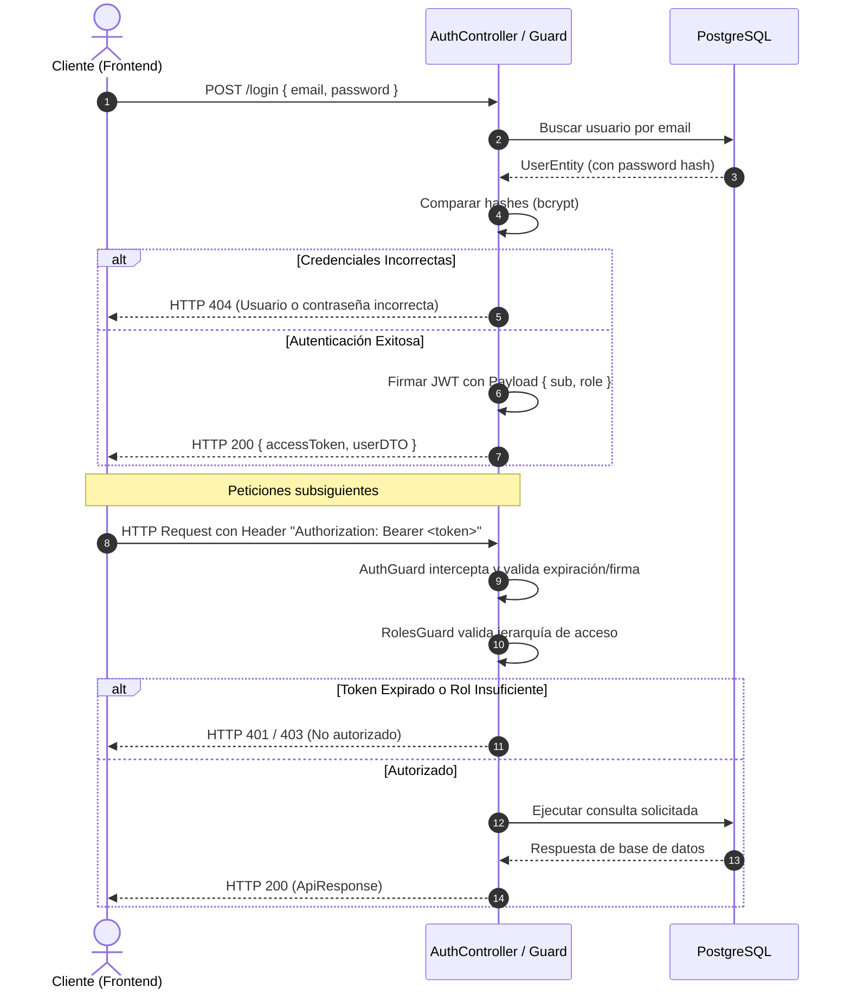
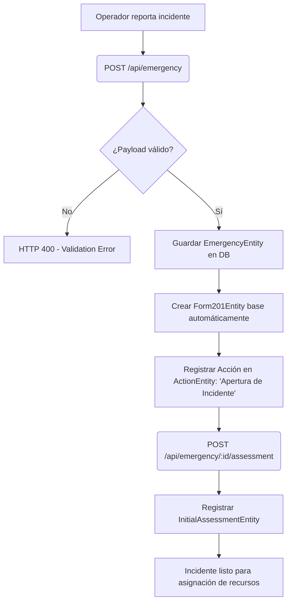
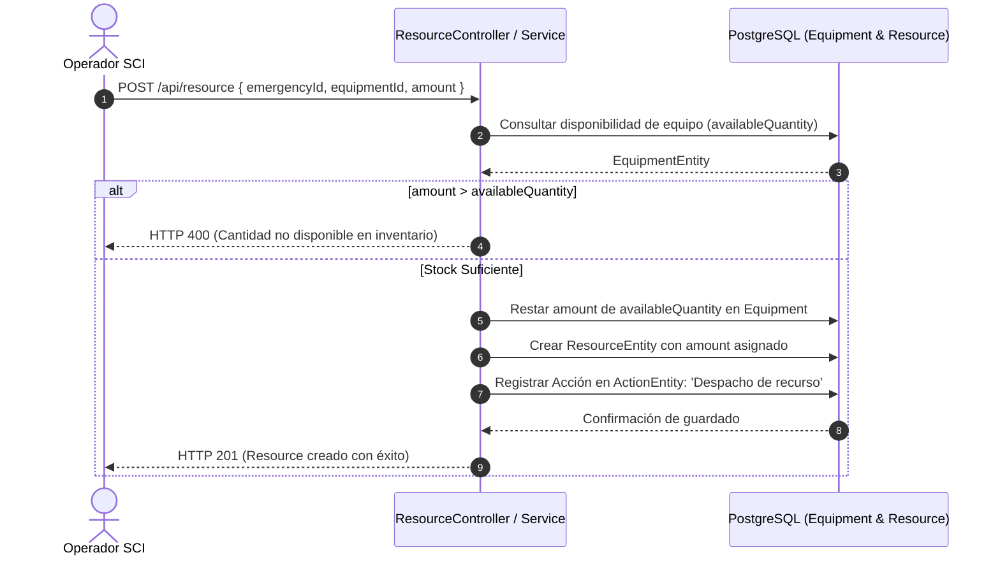
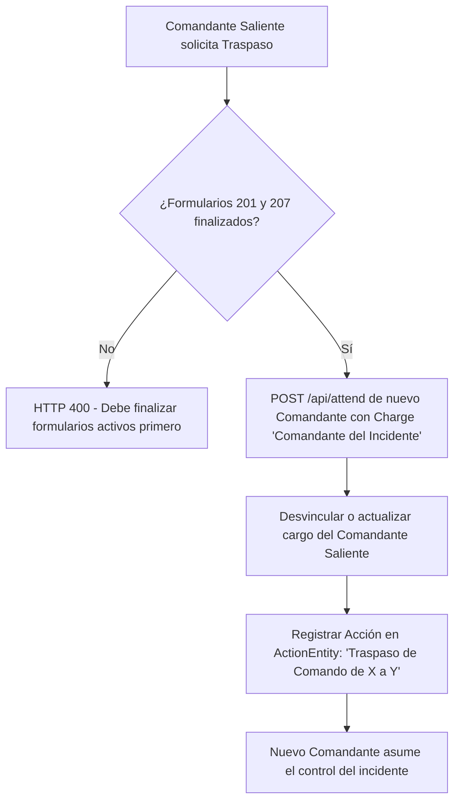
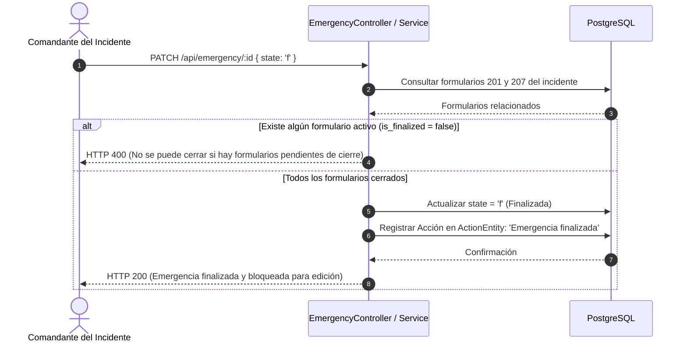

# Flujos del Sistema SCI

Este documento detalla los flujos de interacción clave y procesos operativos dentro de la aplicación mediante diagramas de flujo y secuencia en formato Mermaid.

---

## 1. Flujo de Autenticación y Autorización

Garantiza que todas las transacciones operativas del SCI tengan firma y trazabilidad del usuario que las ejecutó.

---

## 2. Flujo de Declaración de Emergencia y Evaluación Inicial

Proceso de apertura de un incidente en el SCI. La creación de la emergencia genera automáticamente un Formulario 201 base.

---

## 3. Flujo de Asignación de Recursos e Inventario

Despacho de equipamiento del inventario general hacia la emergencia, afectando el stock disponible.

---

## 4. Flujo de Traspaso de Comando del Incidente

Operación crítica que transfiere la autoridad y la responsabilidad del incidente de un oficial a otro.

---

## 5. Flujo de Cierre de Emergencia (Finalización)

Proceso que bloquea el incidente para preservar la validez histórica de las actuaciones de emergencia.

