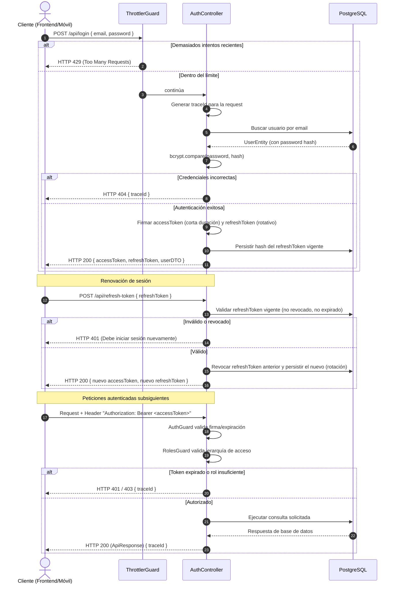
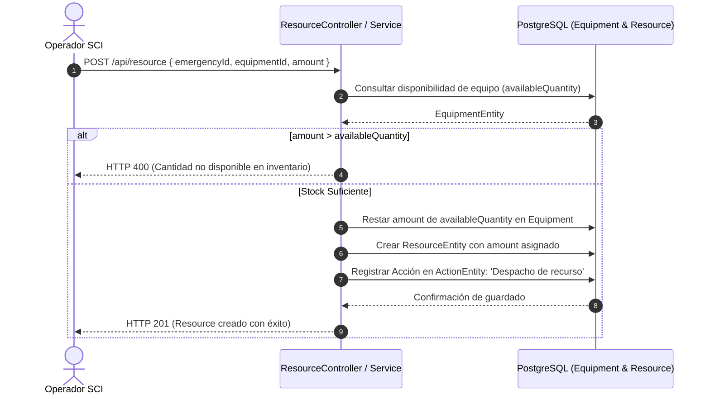
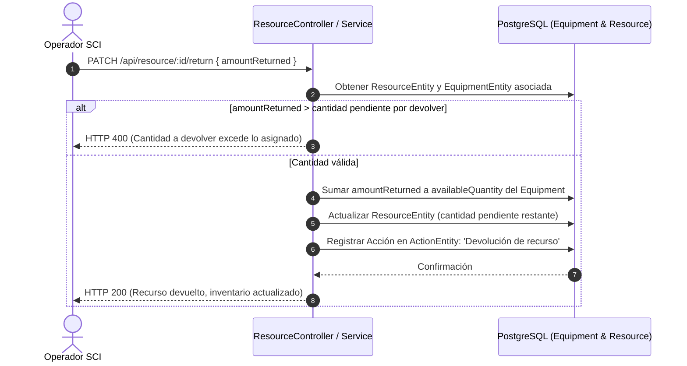
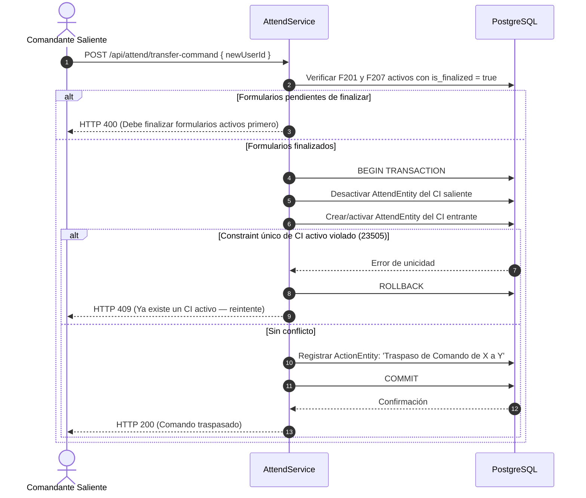
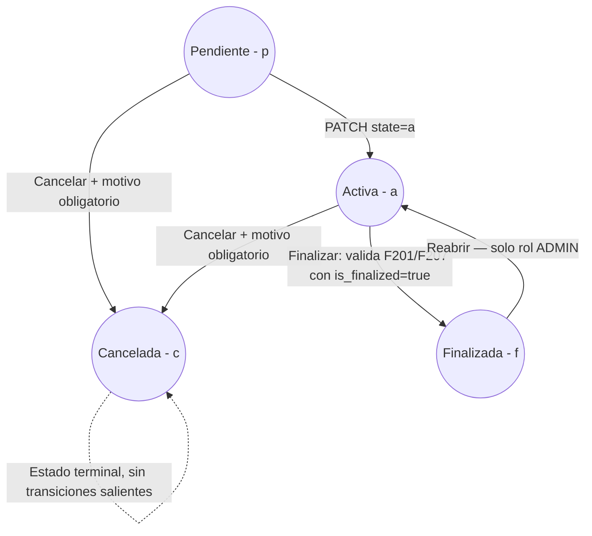
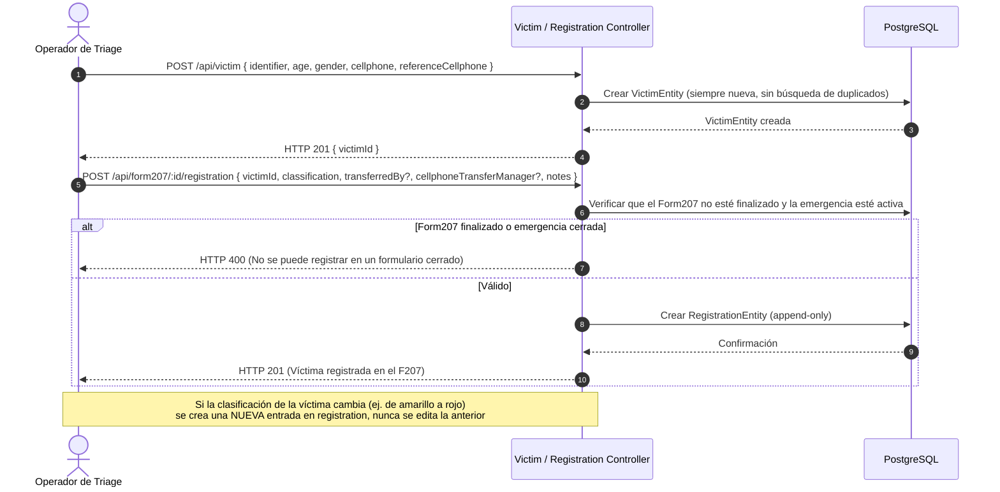
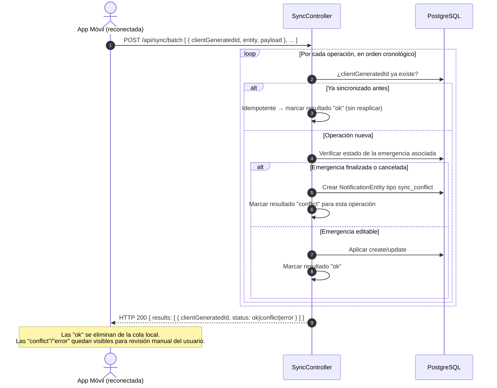
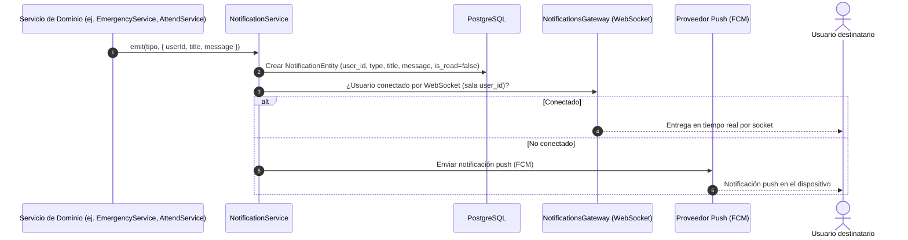
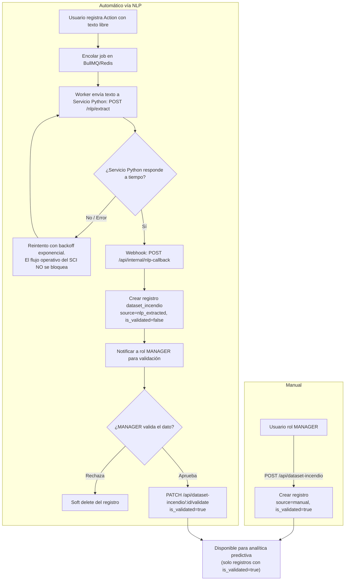
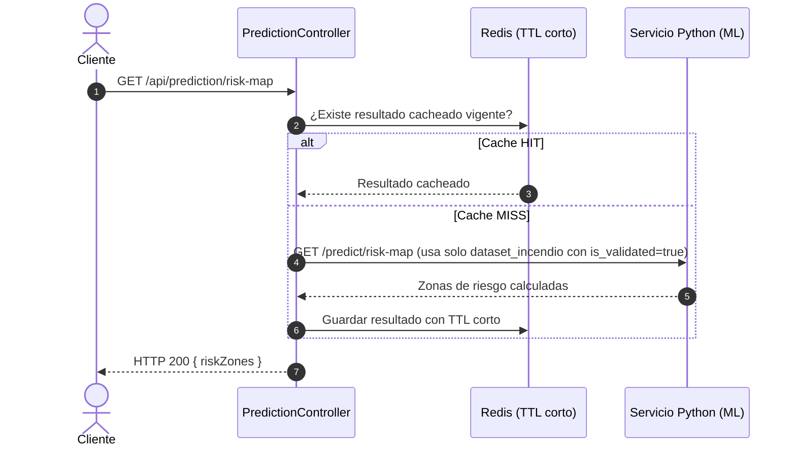

# Flujos del Sistema SCI (v2)

Actualiza el documento de flujos original incorporando: refresh token con rotación y rate limiting, traspaso de comando transaccional, máquina de estados completa, devolución explícita de recursos, registro de víctimas sin deduplicación, sincronización offline con resultados parciales por operación, notificaciones (WebSocket + push) y los flujos de Fase 3 (ingesta a `dataset_incendio` vía NLP asíncrono y consulta de mapa de riesgo).

---

## 1. Flujo de Autenticación y Autorización



---

## 2. Flujo de Declaración de Emergencia y Evaluación Inicial

```mermaid
flowchart TD
    A[Operador reporta incidente] --> B(POST /api/emergency)
    B --> C{¿Payload válido?}
    C -- No --> D[HTTP 400 - Validation Error]
    C -- Sí --> E[Guardar EmergencyEntity, state = 'p' pendiente]
    E --> F[Crear Form201Entity base automáticamente]
    F --> G[Registrar Acción en ActionEntity: 'Apertura de Incidente']
    G --> H(POST /api/emergency/:id/assessment)
    H --> I[Registrar InitialAssessmentEntity]
    I --> J(PATCH /api/emergency/:id { state: 'a' })
    J --> K[Ver Flujo 5: Máquina de Estados]
    K --> L[Incidente activo, listo para asignación de recursos]
```

---

## 3. Flujo de Asignación y Devolución de Recursos

### 3.1 Despacho de recursos



### 3.2 Devolución de recursos (endpoint explícito)

La devolución **no es automática** al finalizar/cancelar la emergencia: requiere una acción explícita del operador, ya que el equipo puede quedar en terreno, dañado, o requerir revisión antes de reingresar al inventario disponible.



**Nota**: esto es posible incluso con la emergencia en estado `Finalizada`, ya que la devolución de equipamiento es logística, no una edición de los datos operativos del incidente. Debe excluirse explícitamente del bloqueo general de edición descrito en el Flujo 5.

---

## 4. Flujo de Traspaso de Comando del Incidente (transaccional)



---

## 5. Máquina de Estados de la Emergencia



Toda transición registra una entrada en `ActionEntity` (usuario, hora, y motivo cuando aplica). Cualquier transición no representada en el diagrama debe rechazarse explícitamente con `BadRequestException`, indicando las transiciones válidas desde el estado actual.

---

## 6. Flujo de Registro de Víctima y Triage (Formulario 207)

Por decisión de negocio, **no hay deduplicación de víctimas**: cada registro crea una `VictimEntity` nueva, incluso si el teléfono coincide con uno ya existente en el sistema. Esto simplifica el flujo en campo (prioridad en triage) a costa de que el mismo individuo pueda existir como más de un registro si aparece en distintos incidentes.



---

## 7. Flujo de Sincronización Offline por Lote

El lote se procesa **operación por operación**: si una falla por conflicto, el resto del lote continúa aplicándose. El cliente recibe un resultado individual por cada `clientGeneratedId` y solo reintenta las que quedaron en conflicto o error.



---

## 8. Flujo de Notificaciones (WebSocket + Push)



---

## 9. Flujo de Ingesta de Dataset de Incendios (`dataset_incendio`)

Cubre las dos vías de carga: manual (siempre validada) y automática vía NLP (requiere validación humana antes de usarse en analítica).



---

## 10. Flujo de Consulta de Mapa de Riesgo Predictivo

