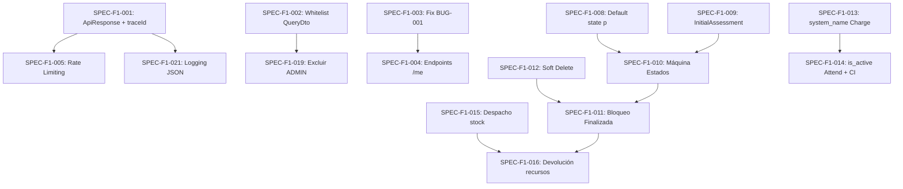

# Plan de Implementación — Completar Fase 1 del Backend SCI

## Contexto y Objetivo

La Fase 1 del sistema SCI tiene como objetivo implementar la **infraestructura de seguridad, autenticación, inventario de equipamiento, catálogo de cargos y la apertura del incidente inicial con evaluación preliminar**. 

Tras analizar el código existente contra las especificaciones en [plan_implementacion.md](file:///c:/Proyectos/SCI/back-sci/docs/implementacion/plan_implementacion.md), [flujos_del_sistema_v2.md](file:///c:/Proyectos/SCI/back-sci/docs/implementacion/flujos_del_sistema_v2.md) y [reglas_implementacion.md](file:///c:/Proyectos/SCI/back-sci/docs/reglas/reglas_implementacion.md), se identificaron **brechas significativas** entre lo documentado y lo implementado.

---

## Análisis de Brechas: Estado Actual vs. Especificación

### ✅ Ya Implementado (parcial o completo)
- Login con bcrypt y JWT (`AuthService`, `AuthController`)
- Guards `AuthGuard` y `RolesGuard` con jerarquía de roles
- CRUD básico de `EmergencyEntity`, `UserEntity`, `AttendEntity`, `ResourceEntity`, `ActionEntity`, `EquipmentEntity`, `ChargeEntity`
- Enum `EmergencyStatus` con los 4 estados (`p`, `a`, `f`, `c`)
- `BaseEntity` con `id`, `created_at`, `updated_at`
- Soft delete manual en `UserEntity` (`is_deleted` flag)

### ❌ Brechas Identificadas (clasificadas por severidad)

| Severidad | Brecha | Referencia Doc |
|:---:|:---|:---|
| 🔴 Crítica | No existe `InitialAssessmentEntity` ni su endpoint | Plan §2, Flujos §2 |
| 🔴 Crítica | No existe máquina de estados de emergencia (cualquier transición es válida) | Reglas §2.3, Flujos §5 |
| 🔴 Crítica | No hay bloqueo de edición en emergencia Finalizada | Reglas §2.3 |
| 🔴 Crítica | `EmergencyEntity` no tiene campo `code` (EMG-XXX) | Plan §2 |
| 🔴 Crítica | `EmergencyEntity` no tiene `is_deleted` (soft delete) | Reglas §4 |
| 🔴 Crítica | `ChargeEntity` no tiene `system_name` | Plan §2, Reglas §2.1 |
| 🔴 Crítica | `AttendEntity` no tiene `is_active` | Reglas §2.1 (CI activo) |
| 🔴 Crítica | `ActionEntity`, `ResourceEntity`, `EquipmentEntity` no tienen `is_deleted` | Reglas §4 |
| 🔴 Crítica | No existe `AuditLogEntity` | Plan §2 |
| 🔴 Crítica | No existe `ApiResponse<T>` ni `ApiErrorResponse` estandarizado | Reglas §3 |
| 🟠 Alta | BUG-001: `deactivate()` y `activate()` comparten ruta `@Get('/deactivate/:id')` | Checklist §2 |
| 🟠 Alta | BUG-002: Inyección SQL via `attr` en QueryBuilder | Checklist §2, Reglas §4 |
| 🟠 Alta | No existe `traceId` en requests ni en respuestas de error | Reglas §3, §5 |
| 🟠 Alta | El `delete` de emergencia es hard delete, no soft delete | Reglas §4 |
| 🟠 Alta | El `delete` de resource y action es hard delete | Reglas §4 |
| 🟠 Alta | `AttendController` no tiene `@UseGuards` | Código actual |
| 🟠 Alta | Resource `create()` no resta stock de `availableQuantity` | Flujos §3.1 |
| 🟠 Alta | No existe endpoint `PATCH /api/resource/:id/return` (devolución) | Plan §3, Flujos §3.2 |
| 🟠 Alta | No existe endpoint de refresh token | Flujos §1 |
| 🟠 Alta | No existe rate limiting (`@nestjs/throttler`) en login | Reglas §4.2, Flujos §1 |
| 🟡 Media | `UserController` no tiene endpoints `/me` (perfil propio) | Plan §3 |
| 🟡 Media | `UserController` no tiene `PATCH /status/:id` separado | Plan §3 |
| 🟡 Media | No existe logging estructurado (JSON) | Reglas §5.1 |
| 🟡 Media | `emergency.state` tiene default `'a'` en vez de `'p'` (pendiente) | Plan §2, Flujos §2 |

---

## Especificaciones de Implementación — Fase 1

Cada especificación está formulada como una **unidad de tarea atómica** con sus criterios de aceptación y tipo de validación requerida.

---

### SPEC-F1-001: Interfaz `ApiResponse<T>` y `ApiErrorResponse`

> **Regla de referencia**: [reglas_implementacion.md §3](file:///c:/Proyectos/SCI/back-sci/docs/reglas/reglas_implementacion.md)

**Descripción**: Reemplazar la interfaz `ResponseMessage` por una interfaz genérica `ApiResponse<T>` para respuestas exitosas y `ApiErrorResponse` para errores, incluyendo el campo `traceId`.

**Archivos a modificar/crear**:
- [MODIFY] [responseMessage.interface.ts](file:///c:/Proyectos/SCI/back-sci/src/common/interfaces/responseMessage.interface.ts) → Reemplazar por `ApiResponse<T>` e `ApiErrorResponse`
- [NEW] `src/common/filters/http-exception.filter.ts` → Filtro global de excepciones que formatee errores según `ApiErrorResponse`
- [NEW] `src/common/middleware/trace-id.middleware.ts` → Middleware que genere `traceId` (UUID) por request y lo adjunte al objeto `Request`
- [MODIFY] [main.ts](file:///c:/Proyectos/SCI/back-sci/src/main.ts) → Registrar filtro global y middleware
- [MODIFY] Todos los controllers → Adaptar tipo de retorno a `ApiResponse<T>`

**Criterios de aceptación**:
1. Toda respuesta exitosa sigue la estructura `{ success: true, statusCode, message?, data, meta? }`
2. Toda respuesta de error sigue `{ success: false, statusCode, message, error, timestamp, path, traceId }`
3. El `traceId` es un UUID v4 generado por request y aparece tanto en logs como en la respuesta de error
4. El campo `meta` con `total`, `limit`, `offset` se devuelve en endpoints paginados

**Validación**: 
- ✅ **Test unitario**: Verificar que `HttpExceptionFilter` formatea correctamente `BadRequestException`, `NotFoundException`, `UnauthorizedException` y excepciones genéricas, incluyendo `traceId`
- ✅ **Test unitario**: Verificar que el middleware `TraceIdMiddleware` agrega un UUID válido al request
- ✅ **Test e2e**: Disparar un error de validación en `POST /api/login` con body vacío y verificar estructura `ApiErrorResponse`

---

### SPEC-F1-002: Whitelist de Atributos en `QueryDto` (Fix BUG-002)

> **Regla de referencia**: [reglas_implementacion.md §4](file:///c:/Proyectos/SCI/back-sci/docs/reglas/reglas_implementacion.md), [tareas_y_estado.md BUG-002](file:///c:/Proyectos/SCI/back-sci/docs/checklist/tareas_y_estado.md)

**Descripción**: El parámetro `attr` en `QueryDto` se interpola directamente en el QueryBuilder (`user.${attr} ILIKE ...`), permitiendo inyección SQL. Implementar una whitelist configurable por entidad.

**Archivos a modificar/crear**:
- [NEW] `src/common/decorators/allowed-query-attrs.decorator.ts` → Decorador o constante de whitelist por servicio
- [MODIFY] [query.dto.ts](file:///c:/Proyectos/SCI/back-sci/src/common/dto/query.dto.ts) → Agregar validación o documentar uso seguro
- [MODIFY] [user.service.ts](file:///c:/Proyectos/SCI/back-sci/src/user/services/user.service.ts) → Validar `attr` contra whitelist antes de interpolarlo
- [MODIFY] [emergency.service.ts](file:///c:/Proyectos/SCI/back-sci/src/organization_module/emergency/services/emergency.service.ts) → Misma validación

**Criterios de aceptación**:
1. Si `attr` no está en la whitelist de la entidad consultada, se lanza `BadRequestException('Atributo de búsqueda no permitido.')`
2. El whitelist para `UserEntity` incluye: `['name', 'email', 'is_active', 'role', 'last_name']`
3. El whitelist para `EmergencyEntity` incluye: `['name', 'state', 'type', 'date']`

**Validación**:
- ✅ **Test unitario**: `UserService.findAll()` con `attr = 'password'` → lanza `BadRequestException`
- ✅ **Test unitario**: `UserService.findAll()` con `attr = 'name'` → ejecuta sin error
- ✅ **Test unitario**: `EmergencyService.findAll()` con `attr = '; DROP TABLE--'` → lanza `BadRequestException`

---

### SPEC-F1-003: Fix BUG-001 — Rutas duplicadas en `UserController`

> **Regla de referencia**: [tareas_y_estado.md BUG-001](file:///c:/Proyectos/SCI/back-sci/docs/checklist/tareas_y_estado.md), [plan_implementacion.md §3](file:///c:/Proyectos/SCI/back-sci/docs/implementacion/plan_implementacion.md)

**Descripción**: Los métodos `deactivate()` y `activate()` comparten la misma ruta `@Get('/deactivate/:id')`. Además, la especificación define un único endpoint `PATCH /api/user/status/:id` para cambiar el estado.

**Archivos a modificar**:
- [MODIFY] [user.controller.ts](file:///c:/Proyectos/SCI/back-sci/src/user/controllers/user.controller.ts) → Reemplazar `deactivate()` y `activate()` por un único `PATCH /status/:id` con body `{ is_active: boolean }`
- [NEW] `src/user/dto/update-user-status.dto.ts` → DTO con `is_active: boolean` validado

**Criterios de aceptación**:
1. `PATCH /api/user/status/:id` con `{ is_active: false }` desactiva al usuario
2. `PATCH /api/user/status/:id` con `{ is_active: true }` activa al usuario
3. Requiere rol `MANAGER` o `ADMIN`
4. No existen rutas duplicadas en el controller

**Validación**:
- ✅ **Test unitario**: Verificar que `UserService.update()` cambia `is_active` correctamente
- ✅ **Test e2e**: `PATCH /api/user/status/:id` con `is_active: false` → usuario desactivado; `is_active: true` → usuario activado

---

### SPEC-F1-004: Endpoints `/me` para perfil del usuario logueado

> **Regla de referencia**: [plan_implementacion.md §3](file:///c:/Proyectos/SCI/back-sci/docs/implementacion/plan_implementacion.md)

**Descripción**: Agregar `GET /api/user/me` y `PATCH /api/user/me` para que el usuario logueado pueda consultar y actualizar su propio perfil sin necesidad de conocer su UUID.

**Archivos a modificar**:
- [MODIFY] [user.controller.ts](file:///c:/Proyectos/SCI/back-sci/src/user/controllers/user.controller.ts) → Agregar los dos endpoints con `@GetUser('id')` decorador

**Criterios de aceptación**:
1. `GET /api/user/me` devuelve los datos del usuario autenticado (sin password)
2. `PATCH /api/user/me` permite actualizar campos editables del perfil propio (name, last_name, cellphone, grade)
3. Requiere solo `AuthGuard` (cualquier rol autenticado puede ver/editar su propio perfil)
4. Las rutas `/me` se registran ANTES de `/:id` en el controller para evitar conflictos de matching

**Validación**:
- ✅ **Test e2e**: Login → `GET /api/user/me` → devuelve datos del usuario logueado
- ✅ **Test e2e**: `PATCH /api/user/me` con `{ name: 'Nuevo Nombre' }` → nombre actualizado

---

### SPEC-F1-005: Rate Limiting en endpoints de autenticación

> **Regla de referencia**: [reglas_implementacion.md §4.2](file:///c:/Proyectos/SCI/back-sci/docs/reglas/reglas_implementacion.md), [flujos_del_sistema_v2.md §1](file:///c:/Proyectos/SCI/back-sci/docs/implementacion/flujos_del_sistema_v2.md)

**Descripción**: Implementar rate limiting con `@nestjs/throttler` en los endpoints de login y refresh token para mitigar ataques de fuerza bruta.

**Archivos a modificar/crear**:
- [MODIFY] [app.module.ts](file:///c:/Proyectos/SCI/back-sci/src/app.module.ts) → Importar `ThrottlerModule` con configuración global
- [MODIFY] [auth.controller.ts](file:///c:/Proyectos/SCI/back-sci/src/auth/controllers/auth.controller.ts) → Aplicar `@Throttle()` con limites específicos en `login` y `refresh-token`
- Requiere instalar `@nestjs/throttler`

**Criterios de aceptación**:
1. El endpoint `POST /api/login` tiene un límite de 5 intentos por minuto por IP
2. El endpoint `POST /api/refresh-token` tiene un límite de 10 intentos por minuto por IP
3. Al exceder el límite se devuelve HTTP 429 con el formato `ApiErrorResponse`

**Validación**:
- ✅ **Test e2e**: Enviar 6 requests consecutivas a `POST /api/login` → la 6ta recibe HTTP 429
- ✅ **Test unitario**: Verificar que `ThrottlerModule` está configurado correctamente

---

### SPEC-F1-006: Refresh Token con Rotación

> **Regla de referencia**: [reglas_implementacion.md §4.2](file:///c:/Proyectos/SCI/back-sci/docs/reglas/reglas_implementacion.md), [flujos_del_sistema_v2.md §1](file:///c:/Proyectos/SCI/back-sci/docs/implementacion/flujos_del_sistema_v2.md)

**Descripción**: Actualmente solo existe `accessToken`. Implementar refresh token con rotación: al emitir un nuevo refresh token, el anterior se revoca.

**Archivos a modificar/crear**:
- [NEW] `src/auth/entities/refresh-token.entity.ts` → Entidad para persistir hash de refresh tokens con campos: `id`, `user_id`, `token_hash`, `is_revoked`, `expires_at`, `created_at`
- [MODIFY] [auth.service.ts](file:///c:/Proyectos/SCI/back-sci/src/auth/services/auth.service.ts) → Generar y devolver `refreshToken` en `login()`, crear método `refreshToken()`
- [MODIFY] [auth.controller.ts](file:///c:/Proyectos/SCI/back-sci/src/auth/controllers/auth.controller.ts) → Agregar endpoint `POST /api/refresh-token`
- [MODIFY] [auth.module.ts](file:///c:/Proyectos/SCI/back-sci/src/auth/auth.module.ts) → Registrar nueva entidad

**Criterios de aceptación**:
1. `POST /api/login` devuelve `{ accessToken, refreshToken, user }`
2. `POST /api/refresh-token` con `{ refreshToken }` devuelve nuevos `accessToken` y `refreshToken`
3. El refresh token anterior queda revocado (`is_revoked: true`)
4. Un refresh token revocado retorna HTTP 401
5. Un refresh token expirado retorna HTTP 401
6. El hash del refresh token se persiste en DB (nunca el token en texto plano)

**Validación**:
- ✅ **Test unitario**: `AuthService.refreshToken()` con token válido → genera nuevos tokens y revoca el anterior
- ✅ **Test unitario**: `AuthService.refreshToken()` con token revocado → lanza `UnauthorizedException`
- ✅ **Test e2e**: Flujo completo login → refresh → segundo refresh con token antiguo → HTTP 401

---

### SPEC-F1-007: Campo `code` auto-generado en `EmergencyEntity` (EMG-XXX)

> **Regla de referencia**: [plan_implementacion.md §2](file:///c:/Proyectos/SCI/back-sci/docs/implementacion/plan_implementacion.md)

**Descripción**: La entidad `EmergencyEntity` requiere un campo `code` único con formato `EMG-XXX` (ej. `EMG-001`, `EMG-002`), auto-generado al crear la emergencia.

**Archivos a modificar**:
- [MODIFY] [emergency.entity.ts](file:///c:/Proyectos/SCI/back-sci/src/organization_module/emergency/entities/emergency.entity.ts) → Agregar columna `code` (varchar(20), unique)
- [MODIFY] [emergency.service.ts](file:///c:/Proyectos/SCI/back-sci/src/organization_module/emergency/services/emergency.service.ts) → Auto-generar código correlativo en `create()`

**Criterios de aceptación**:
1. Al crear una emergencia se genera automáticamente un código `EMG-XXX` donde XXX es correlativo
2. El campo `code` es único en la base de datos
3. El código no requiere input del cliente
4. El correlativo se genera de forma segura ante concurrencia (usar `MAX(code)` dentro de transacción o secuencia)

**Validación**:
- ✅ **Test unitario**: Crear 3 emergencias → códigos `EMG-001`, `EMG-002`, `EMG-003`
- ✅ **Test de integración**: Crear 2 emergencias concurrentes → códigos únicos sin colisión

---

### SPEC-F1-008: Default de `state` a `'p'` (Pendiente) y relación con `initial_assessment`

> **Regla de referencia**: [plan_implementacion.md §2](file:///c:/Proyectos/SCI/back-sci/docs/implementacion/plan_implementacion.md), [flujos_del_sistema_v2.md §2](file:///c:/Proyectos/SCI/back-sci/docs/implementacion/flujos_del_sistema_v2.md)

**Descripción**: Actualmente `state` tiene default `'a'` (activa). Según la especificación, una emergencia nace en estado `'p'` (pendiente) y transiciona a `'a'` tras la evaluación inicial. Además, se debe agregar la relación con `InitialAssessmentEntity`.

**Archivos a modificar**:
- [MODIFY] [emergency.entity.ts](file:///c:/Proyectos/SCI/back-sci/src/organization_module/emergency/entities/emergency.entity.ts) → Cambiar default de `state` a `'p'`; agregar relación `@OneToOne` con `InitialAssessmentEntity`
- [MODIFY] [create-emergency.dto.ts](file:///c:/Proyectos/SCI/back-sci/src/organization_module/emergency/dto/create-emergency.dto.ts) → Remover `state` del DTO de creación (se asigna automáticamente como `'p'`)

**Criterios de aceptación**:
1. Una emergencia creada siempre tiene `state = 'p'`
2. El estado no es un campo editable vía `CreateEmergencyDto`
3. La entidad tiene relación OneToOne con `InitialAssessmentEntity`

**Validación**:
- ✅ **Test unitario**: `EmergencyService.create()` → entidad creada tiene `state === 'p'`
- ✅ **Test e2e**: `POST /api/emergency` sin campo `state` → respuesta con `state: 'p'`

---

### SPEC-F1-009: Entidad `InitialAssessmentEntity` y endpoints de evaluación inicial

> **Regla de referencia**: [plan_implementacion.md §2](file:///c:/Proyectos/SCI/back-sci/docs/implementacion/plan_implementacion.md), [flujos_del_sistema_v2.md §2](file:///c:/Proyectos/SCI/back-sci/docs/implementacion/flujos_del_sistema_v2.md)

**Descripción**: Crear la entidad, servicio, controller y DTOs para la evaluación inicial del incidente.

**Archivos a crear**:
- [NEW] `src/organization_module/emergency/entities/initial-assessment.entity.ts`
- [NEW] `src/organization_module/emergency/dto/create-initial-assessment.dto.ts`
- [NEW] `src/organization_module/emergency/dto/update-initial-assessment.dto.ts`
- [NEW] `src/organization_module/emergency/services/initial-assessment.service.ts`
- [NEW] `src/organization_module/emergency/controllers/initial-assessment.controller.ts`
- [MODIFY] [emergency.module.ts](file:///c:/Proyectos/SCI/back-sci/src/organization_module/emergency/emergency.module.ts) → Registrar nueva entidad, servicio y controller

**Campos de la entidad** (según Plan §2):
- `id` (UUID, PK)
- `hazard_type` (varchar(100))
- `severity_level` (varchar(20)) — Bajo, Medio, Alto, Extremo
- `affected_people_estimated` (int)
- `situation_description` (text)
- `weather_conditions` (varchar(100))
- `created_at` / `updated_at`

**Endpoints** (según Plan §3):
- `POST /api/emergency/:id/assessment` → Crear evaluación inicial (AuthGuard, BASIC)
- `PATCH /api/emergency/:id/assessment` → Modificar evaluación (AuthGuard, BASIC)

**Criterios de aceptación**:
1. Solo se permite una evaluación inicial por emergencia
2. Si ya existe una evaluación, `POST` devuelve error indicando que debe usar `PATCH`
3. El DTO valida que `severity_level` esté en `['Bajo', 'Medio', 'Alto', 'Extremo']`
4. La creación de la evaluación registra una `ActionEntity` automática: `'Evaluación Inicial registrada'`

**Validación**:
- ✅ **Test unitario**: Crear evaluación → entidad persistida con los campos correctos
- ✅ **Test unitario**: Crear segunda evaluación para la misma emergencia → `BadRequestException`
- ✅ **Test e2e**: `POST /api/emergency/:id/assessment` → HTTP 201 con datos de evaluación

---

### SPEC-F1-010: Máquina de Estados de la Emergencia (`EmergencyStateMachine`)

> **Regla de referencia**: [reglas_implementacion.md §2.3](file:///c:/Proyectos/SCI/back-sci/docs/reglas/reglas_implementacion.md), [flujos_del_sistema_v2.md §5](file:///c:/Proyectos/SCI/back-sci/docs/implementacion/flujos_del_sistema_v2.md)

**Descripción**: Implementar una máquina de estados explícita que gobierne las transiciones de la emergencia, en lugar de permitir cualquier cambio vía `UpdateEmergencyDto`.

**Archivos a crear/modificar**:
- [NEW] `src/organization_module/emergency/services/emergency-state-machine.ts` → Mapa de transiciones permitidas con validaciones
- [MODIFY] [emergency.service.ts](file:///c:/Proyectos/SCI/back-sci/src/organization_module/emergency/services/emergency.service.ts) → Usar `EmergencyStateMachine` en `update()`; separar endpoint de cambio de estado
- [MODIFY] [emergency.controller.ts](file:///c:/Proyectos/SCI/back-sci/src/organization_module/emergency/controllers/emergency.controller.ts) → Asegurar que el cambio de estado pasa por la máquina de estados
- [NEW] `src/organization_module/emergency/dto/change-emergency-state.dto.ts` → DTO con `state` y `cancellation_reason?`

**Transiciones válidas** (tabla de Reglas §2.3):

| Desde | Hacia | Condiciones |
|:---:|:---:|:---|
| `p` | `a` | Registrar fecha/hora de activación en `ActionEntity` |
| `p` | `c` | Motivo de cancelación obligatorio → `ActionEntity` |
| `a` | `c` | Motivo de cancelación obligatorio → `ActionEntity` |
| `a` | `f` | Validar que **todos** los formularios (F201/F207) tengan `is_finalized: true` |
| `f` | `a` | Solo rol `ADMIN` (reapertura) → `ActionEntity` |

**Criterios de aceptación**:
1. `p → a`: se registra acción de activación
2. `p → c` y `a → c`: requiere `cancellation_reason` obligatorio; se registra en `ActionEntity`
3. `a → f`: valida formularios finalizados; si hay pendientes → `BadRequestException` con lista de formularios
4. `f → a`: solo `ADMIN`; se registra reapertura
5. `c → *`: rechazado → estado terminal
6. `p → f`, `f → c`, `f → p`: rechazados con mensaje indicando transiciones válidas
7. Implementado como mapa de transiciones, no como cadena de `if/else`

**Validación**:
- ✅ **Test unitario** (uno por cada transición de la tabla completa, 9 combinaciones):
  - `p → a` ✅ con ActionEntity
  - `p → f` ❌ BadRequestException
  - `p → c` ✅ con motivo obligatorio
  - `a → a` (no-op o error)
  - `a → f` ✅ con validación de formularios
  - `a → c` ✅ con motivo obligatorio
  - `f → a` ✅ solo ADMIN
  - `f → c` ❌ BadRequestException
  - `c → a` ❌ BadRequestException (terminal)
- ✅ **Test de integración**: Recorrer ciclo completo `p → a → f → a (ADMIN) → f` verificando `ActionEntity` en cada paso

---

### SPEC-F1-011: Bloqueo de edición en emergencia Finalizada

> **Regla de referencia**: [reglas_implementacion.md §2.3](file:///c:/Proyectos/SCI/back-sci/docs/reglas/reglas_implementacion.md)

**Descripción**: Una emergencia en estado `'f'` (Finalizada) no permite edición de sus datos ni de sus recursos asociados.

**Archivos a modificar**:
- [MODIFY] [emergency.service.ts](file:///c:/Proyectos/SCI/back-sci/src/organization_module/emergency/services/emergency.service.ts) → Verificar estado antes de `update()`
- [MODIFY] [resource.service.ts](file:///c:/Proyectos/SCI/back-sci/src/organization_module/resource/services/resource.service.ts) → Verificar estado de emergencia asociada antes de `create()` y `update()`
- [MODIFY] [action.service.ts](file:///c:/Proyectos/SCI/back-sci/src/incident_module/action/services/action.service.ts) → Verificar estado de emergencia antes de `create()`
- [MODIFY] [attends.service.ts](file:///c:/Proyectos/SCI/back-sci/src/organization_module/attends/services/attends.service.ts) → Verificar estado de emergencia antes de `create()`

**Criterios de aceptación**:
1. `PATCH /api/emergency/:id` con emergencia finalizada → `BadRequestException('La emergencia está finalizada...')`
2. `POST /api/resource` con emergencia finalizada → `BadRequestException`
3. `POST /api/action` con emergencia finalizada → `BadRequestException`
4. `POST /api/attend` con emergencia finalizada → `BadRequestException`
5. **Excepción**: La devolución de recursos (`PATCH /api/resource/:id/return`) SÍ se permite en emergencia finalizada (es logística, no edición operativa, ver Flujos §3.2)

**Validación**:
- ✅ **Test unitario**: Intentar editar emergencia finalizada → `BadRequestException`
- ✅ **Test unitario**: Intentar crear recurso para emergencia finalizada → `BadRequestException`
- ✅ **Test unitario**: Devolver recurso en emergencia finalizada → permitido
- ✅ **Test de integración**: Finalizar emergencia → intentar editar → reabrir como ADMIN → editar exitosamente

---

### SPEC-F1-012: Soft Delete global en todas las entidades de Fase 1

> **Regla de referencia**: [reglas_implementacion.md §4](file:///c:/Proyectos/SCI/back-sci/docs/reglas/reglas_implementacion.md)

**Descripción**: Implementar soft delete (`is_deleted: boolean`) en todas las entidades que actualmente usan hard delete.

**Archivos a modificar**:
- [MODIFY] [emergency.entity.ts](file:///c:/Proyectos/SCI/back-sci/src/organization_module/emergency/entities/emergency.entity.ts) → Agregar `is_deleted`
- [MODIFY] [equipment.entity.ts](file:///c:/Proyectos/SCI/back-sci/src/organization_module/equipment/entities/equipment.entity.ts) → Agregar `is_deleted`
- [MODIFY] [resource.entity.ts](file:///c:/Proyectos/SCI/back-sci/src/organization_module/resource/entities/resource.entity.ts) → Agregar `is_deleted`
- [MODIFY] [action.entity.ts](file:///c:/Proyectos/SCI/back-sci/src/incident_module/action/entities/action.entity.ts) → Agregar `is_deleted`
- [MODIFY] Servicios correspondientes → Cambiar `delete()` de hard delete a `update({ is_deleted: true })`, y agregar filtro `is_deleted = false` en todas las consultas `find`

**Criterios de aceptación**:
1. `DELETE /api/emergency/:id` marca `is_deleted = true` en vez de borrar físicamente
2. `DELETE /api/equipment/:id` marca `is_deleted = true`
3. Los listados (`findAll`, `findByEmergency`, etc.) excluyen registros con `is_deleted = true`
4. No existe ningún `Repository.delete()` físico en servicios de entidades operativas

**Validación**:
- ✅ **Test unitario** (por cada servicio): `delete()` → `is_deleted = true` y el registro sigue en DB
- ✅ **Test unitario**: `findAll()` no retorna registros con `is_deleted = true`

---

### SPEC-F1-013: Campo `system_name` en `ChargeEntity`

> **Regla de referencia**: [plan_implementacion.md §2](file:///c:/Proyectos/SCI/back-sci/docs/implementacion/plan_implementacion.md), [reglas_implementacion.md §2.1](file:///c:/Proyectos/SCI/back-sci/docs/reglas/reglas_implementacion.md)

**Descripción**: La entidad `ChargeEntity` requiere un campo `system_name` para identificar programáticamente el cargo de "Comandante del Incidente" (`'incident_commander'`).

**Archivos a modificar**:
- [MODIFY] [charges.entity.ts](file:///c:/Proyectos/SCI/back-sci/src/sci_module/charges/entities/charges.entity.ts) → Agregar `system_name` (varchar(100), nullable)
- [MODIFY] Seeder de cargos → Incluir `system_name` en los datos de carga

**Criterios de aceptación**:
1. `ChargeEntity` tiene el campo `system_name` persistido
2. El cargo "Comandante del Incidente" tiene `system_name = 'incident_commander'`
3. El seeder actualiza los registros existentes con `system_name` apropiado

**Validación**:
- ✅ **Test unitario**: Verificar que el seeder asigna `system_name` correcto al CI
- ✅ **Test de integración**: Consultar `ChargeEntity` donde `system_name = 'incident_commander'` → exactamente 1 resultado

---

### SPEC-F1-014: Campo `is_active` en `AttendEntity` e índice único parcial para CI

> **Regla de referencia**: [reglas_implementacion.md §2.1](file:///c:/Proyectos/SCI/back-sci/docs/reglas/reglas_implementacion.md)

**Descripción**: `AttendEntity` necesita un campo `is_active` para gestionar traspasos de comando y un índice único parcial que garantice un solo CI activo por emergencia.

**Archivos a modificar**:
- [MODIFY] [attends.entity.ts](file:///c:/Proyectos/SCI/back-sci/src/organization_module/attends/entities/attends.entity.ts) → Agregar `is_active` (boolean, default true)
- [MODIFY] [attends.service.ts](file:///c:/Proyectos/SCI/back-sci/src/organization_module/attends/services/attends.service.ts) → Al crear, verificar unicidad de CI; capturar error `23505` y convertir a `ConflictException`
- [NEW] Índice único parcial vía sincronización de TypeORM o script SQL: `CREATE UNIQUE INDEX uq_attend_incident_commander_active ON attend (emergency_id) WHERE charge_system_name = 'incident_commander' AND is_active = true`

**Criterios de aceptación**:
1. `AttendEntity` tiene campo `is_active` con default `true`
2. Solo puede existir un registro con `charge.system_name = 'incident_commander'` y `is_active = true` por `emergency_id`
3. Si se viola el constraint, se devuelve `ConflictException('Ya existe un CI activo para esta emergencia')`
4. Al desactivar un attend (`is_active = false`), se permite asignar un nuevo CI

**Validación**:
- ✅ **Test unitario**: Crear dos attends con cargo CI para misma emergencia → segundo falla con `ConflictException`
- ✅ **Test de integración**: Asignar CI → desactivar → asignar nuevo CI → éxito
- ✅ **Test de integración** (concurrencia): Dos requests simultáneas de asignación de CI → solo una tiene éxito

---

### SPEC-F1-015: Lógica de despacho de recursos (restar stock de `availableQuantity`)

> **Regla de referencia**: [flujos_del_sistema_v2.md §3.1](file:///c:/Proyectos/SCI/back-sci/docs/implementacion/flujos_del_sistema_v2.md)

**Descripción**: Actualmente `ResourceService.create()` no resta la cantidad del inventario disponible en `EquipmentEntity.availableQuantity`. Además, debe validar que haya stock suficiente.

**Archivos a modificar**:
- [MODIFY] [resource.service.ts](file:///c:/Proyectos/SCI/back-sci/src/organization_module/resource/services/resource.service.ts) → En `create()`: validar `amount <= availableQuantity`, restar `availableQuantity`, registrar `ActionEntity`

**Criterios de aceptación**:
1. Al despachar recurso: `equipment.availableQuantity -= resource.amount`
2. Si `amount > availableQuantity` → `BadRequestException('Cantidad no disponible en inventario')`
3. Se registra `ActionEntity: 'Despacho de recurso: {equipment.name} x{amount}'`
4. La operación es atómica (transacción para evitar race conditions)

**Validación**:
- ✅ **Test unitario**: Despachar 5 unidades de equipo con 10 disponibles → `availableQuantity = 5`
- ✅ **Test unitario**: Despachar 15 unidades de equipo con 10 disponibles → `BadRequestException`
- ✅ **Test de integración**: Dos despachos concurrentes que exceden stock combinado → solo uno tiene éxito

---

### SPEC-F1-016: Endpoint de devolución de recursos (`PATCH /api/resource/:id/return`)

> **Regla de referencia**: [plan_implementacion.md §3](file:///c:/Proyectos/SCI/back-sci/docs/implementacion/plan_implementacion.md), [flujos_del_sistema_v2.md §3.2](file:///c:/Proyectos/SCI/back-sci/docs/implementacion/flujos_del_sistema_v2.md)

**Descripción**: Crear un endpoint explícito para devolver recursos al inventario. Requiere rol `MANAGER` o `ADMIN`.

**Archivos a crear/modificar**:
- [NEW] `src/organization_module/resource/dto/return-resource.dto.ts` → DTO con `amountReturned: number`
- [MODIFY] [resource.entity.ts](file:///c:/Proyectos/SCI/back-sci/src/organization_module/resource/entities/resource.entity.ts) → Agregar campo `amount_returned` (int, default 0) para rastrear devoluciones parciales
- [MODIFY] [resource.service.ts](file:///c:/Proyectos/SCI/back-sci/src/organization_module/resource/services/resource.service.ts) → Implementar `returnResource(id, amountReturned)`
- [MODIFY] [resource.controller.ts](file:///c:/Proyectos/SCI/back-sci/src/organization_module/resource/controllers/resource.controller.ts) → Agregar `PATCH /:id/return`

**Criterios de aceptación**:
1. `PATCH /api/resource/:id/return` con `{ amountReturned: N }` suma N a `equipment.availableQuantity`
2. Si `amountReturned > (amount - amount_returned)` → `BadRequestException('Cantidad a devolver excede lo asignado')`
3. `resource.amount_returned += amountReturned`
4. Se registra `ActionEntity: 'Devolución de recurso'`
5. Requiere rol `MANAGER` o `ADMIN`
6. Se permite aunque la emergencia esté Finalizada (es logística, no edición operativa)

**Validación**:
- ✅ **Test unitario**: Devolver 3 unidades de 5 despachadas → `amount_returned = 3`, `availableQuantity += 3`
- ✅ **Test unitario**: Devolver 6 unidades de 5 despachadas → `BadRequestException`
- ✅ **Test unitario**: Devolver recursos con emergencia finalizada → permitido

---

### SPEC-F1-017: Entidad `AuditLogEntity` e interceptor de auditoría global

> **Regla de referencia**: [plan_implementacion.md §2](file:///c:/Proyectos/SCI/back-sci/docs/implementacion/plan_implementacion.md), [reglas_implementacion.md §2.1](file:///c:/Proyectos/SCI/back-sci/docs/reglas/reglas_implementacion.md)

**Descripción**: Crear la entidad de auditoría y un interceptor NestJS que registre automáticamente operaciones CREATE, UPDATE, DELETE en todas las entidades operativas.

**Archivos a crear**:
- [NEW] `src/common/entities/audit-log.entity.ts` → Entidad según Plan §2
- [NEW] `src/common/interceptors/audit-log.interceptor.ts` → Interceptor que capture operaciones de escritura
- [NEW] `src/common/services/audit-log.service.ts` → Servicio para persistir logs de auditoría
- [MODIFY] [app.module.ts](file:///c:/Proyectos/SCI/back-sci/src/app.module.ts) → Registrar entidad y servicio
- [MODIFY] [common.module.ts](file:///c:/Proyectos/SCI/back-sci/src/common/common.module.ts) → Exportar servicio

**Campos de la entidad** (según Plan §2):
- `id` (UUID, PK)
- `user_id` (UUID, FK → user, nullable)
- `user_role` (varchar(50), nullable)
- `event_type` (varchar(20)) — `CREATE`, `UPDATE`, `DELETE`
- `entity_name` (varchar(100))
- `entity_id` (UUID)
- `old_values` (jsonb, nullable)
- `new_values` (jsonb, nullable)
- `ip_address` (varchar(45), nullable)
- `created_at` (timestamp)

**Criterios de aceptación**:
1. Toda operación CREATE en endpoints protegidos genera un registro en `audit_log`
2. Toda operación UPDATE genera un registro con `old_values` y `new_values`
3. Toda operación DELETE (soft) genera un registro
4. `user_id` y `user_role` se extraen del request autenticado
5. `ip_address` se extrae del request

**Validación**:
- ✅ **Test unitario**: `AuditLogService.log()` persiste correctamente los campos
- ✅ **Test de integración**: Crear una emergencia → verificar que existe un registro `audit_log` con `event_type = 'CREATE'`, `entity_name = 'EmergencyEntity'`

---

### SPEC-F1-018: Guards faltantes en `AttendController`

> **Regla de referencia**: [plan_implementacion.md §3](file:///c:/Proyectos/SCI/back-sci/docs/implementacion/plan_implementacion.md) — Attend requiere `AuthGuard` + `RolesGuard` con rol `MANAGER` o `ADMIN`

**Descripción**: `AttendController` no tiene `@UseGuards(AuthGuard, RolesGuard)` a nivel de clase, exponiendo los endpoints.

**Archivos a modificar**:
- [MODIFY] [attends.controller.ts](file:///c:/Proyectos/SCI/back-sci/src/organization_module/attends/controllers/attends.controller.ts) → Agregar `@UseGuards(AuthGuard, RolesGuard)` y `@RolesAccess(ROLES.MANAGER)` según Plan §3
- [NEW] Agregar endpoint `PATCH /api/attend/:id` para actualizar cargo del personal

**Criterios de aceptación**:
1. Todos los endpoints de `AttendController` están protegidos con `AuthGuard` y `RolesGuard`
2. `POST`, `PATCH`, `DELETE` requieren rol mínimo `MANAGER`
3. `GET` requiere rol mínimo `BASIC` (según convención del proyecto)
4. Existe endpoint `PATCH /api/attend/:id` que permite cambiar el cargo asignado

**Validación**:
- ✅ **Test e2e**: Request sin token a `POST /api/attend` → HTTP 401
- ✅ **Test e2e**: Request con token `BASIC` a `POST /api/attend` → HTTP 403
- ✅ **Test e2e**: Request con token `MANAGER` a `POST /api/attend` → HTTP 201

---

### SPEC-F1-019: Exclusión del `ADMIN` de listados de usuarios

> **Regla de referencia**: [reglas_implementacion.md §2.1](file:///c:/Proyectos/SCI/back-sci/docs/reglas/reglas_implementacion.md)

**Descripción**: El usuario con rol `ADMIN` debe ser excluido de las consultas y listados de usuarios para proteger el acceso prioritario al sistema.

**Archivos a modificar**:
- [MODIFY] [user.service.ts](file:///c:/Proyectos/SCI/back-sci/src/user/services/user.service.ts) → En `findAll()`, agregar condición `WHERE role != 'ADMIN'`

**Criterios de aceptación**:
1. `GET /api/user` no incluye usuarios con rol `ADMIN` en los resultados
2. El filtro se aplica siempre, independientemente del rol del solicitante

**Validación**:
- ✅ **Test unitario**: `findAll()` con un ADMIN en DB → no aparece en resultados
- ✅ **Test e2e**: Crear ADMIN via seeder → `GET /api/user` → no incluido en la lista

---

### SPEC-F1-020: Seeder de producción con variables de entorno

> **Regla de referencia**: [tareas_y_estado.md §1](file:///c:/Proyectos/SCI/back-sci/docs/checklist/tareas_y_estado.md)

**Descripción**: El seeder actual crea datos hardcodeados. Debe consumir variables de entorno para crear el usuario administrador inicial en producción.

**Archivos a modificar**:
- [MODIFY] [seed.service.ts](file:///c:/Proyectos/SCI/back-sci/src/seeder/seed.service.ts) → Leer `ADMIN_EMAIL`, `ADMIN_PASSWORD`, `ADMIN_NAME` de variables de entorno
- [MODIFY] [.env.example](file:///c:/Proyectos/SCI/back-sci/.env.example) → Documentar las nuevas variables

**Criterios de aceptación**:
1. El seeder crea el usuario admin solo si no existe previamente (`findByEmail`)
2. Las credenciales del admin se leen de `process.env`
3. Si las variables de entorno no están definidas, el seeder lanza un error claro
4. Los cargos SCI se siguen cargando normalmente (ya hardcodeados es aceptable)

**Validación**:
- ✅ **Test unitario**: Seeder con variables de entorno definidas → crea admin
- ✅ **Test unitario**: Seeder sin variables → lanza error descriptivo
- ✅ **Test unitario**: Seeder con admin ya existente → no duplica

---

### SPEC-F1-021: Logging estructurado (JSON) con `traceId`

> **Regla de referencia**: [reglas_implementacion.md §5.1](file:///c:/Proyectos/SCI/back-sci/docs/reglas/reglas_implementacion.md)

**Descripción**: Reemplazar los logs de texto plano (morgan + console.log) por logging estructurado en JSON con `traceId` propagado.

**Archivos a crear/modificar**:
- Instalar `nestjs-pino` + `pino-pretty` (para desarrollo)
- [MODIFY] [app.module.ts](file:///c:/Proyectos/SCI/back-sci/src/app.module.ts) → Importar `LoggerModule` de `nestjs-pino`
- [MODIFY] [main.ts](file:///c:/Proyectos/SCI/back-sci/src/main.ts) → Reemplazar morgan por el logger de pino; configurar `bufferLogs`
- [MODIFY] Todos los servicios → Reemplazar `console.log` por `Logger` de NestJS

**Criterios de aceptación**:
1. Todos los logs se emiten en formato JSON con: `timestamp`, `level`, `traceId`, `module`, `message`
2. En desarrollo (`NODE_ENV=development`), se usa `pino-pretty` para legibilidad
3. El `traceId` generado por el middleware de SPEC-F1-001 se incluye en cada log de la request
4. No se loguean contraseñas ni tokens completos

**Validación**:
- ✅ **Test unitario**: Verificar que la configuración de pino excluye campos sensibles
- ✅ **Verificación manual**: Ejecutar el servidor → cada request genera logs JSON con `traceId`

---

### SPEC-F1-022: Corrección de `AuthGuard` — Error handling específico

> **Regla de referencia**: Código actual de [auth.guard.ts](file:///c:/Proyectos/SCI/back-sci/src/auth/guards/auth.guard.ts)

**Descripción**: El `AuthGuard` actual atrapa todos los errores y lanza `InternalServerErrorException`, perdiendo la información original del error (ej. `UnauthorizedException`). Debe propagar correctamente las excepciones HTTP conocidas.

**Archivos a modificar**:
- [MODIFY] [auth.guard.ts](file:///c:/Proyectos/SCI/back-sci/src/auth/guards/auth.guard.ts) → Re-throw de `HttpException` conocidas; solo `InternalServerErrorException` para errores inesperados

**Criterios de aceptación**:
1. Token inválido → HTTP 401 (no 500)
2. Token expirado → HTTP 401 (no 500)
3. Token ausente → HTTP 401 (no 500)
4. Error inesperado de DB → HTTP 500

**Validación**:
- ✅ **Test unitario**: Request sin token → `UnauthorizedException` (401)
- ✅ **Test unitario**: Request con token expirado → `UnauthorizedException` (401)

---

## Resumen de Archivos Nuevos y Modificados

### Archivos Nuevos (14)
| # | Archivo | Spec |
|:---:|:---|:---:|
| 1 | `src/common/filters/http-exception.filter.ts` | F1-001 |
| 2 | `src/common/middleware/trace-id.middleware.ts` | F1-001 |
| 3 | `src/common/decorators/allowed-query-attrs.decorator.ts` | F1-002 |
| 4 | `src/user/dto/update-user-status.dto.ts` | F1-003 |
| 5 | `src/auth/entities/refresh-token.entity.ts` | F1-006 |
| 6 | `src/organization_module/emergency/entities/initial-assessment.entity.ts` | F1-009 |
| 7 | `src/organization_module/emergency/dto/create-initial-assessment.dto.ts` | F1-009 |
| 8 | `src/organization_module/emergency/dto/update-initial-assessment.dto.ts` | F1-009 |
| 9 | `src/organization_module/emergency/services/initial-assessment.service.ts` | F1-009 |
| 10 | `src/organization_module/emergency/controllers/initial-assessment.controller.ts` | F1-009 |
| 11 | `src/organization_module/emergency/services/emergency-state-machine.ts` | F1-010 |
| 12 | `src/organization_module/emergency/dto/change-emergency-state.dto.ts` | F1-010 |
| 13 | `src/organization_module/resource/dto/return-resource.dto.ts` | F1-016 |
| 14 | `src/common/entities/audit-log.entity.ts` + service + interceptor | F1-017 |

### Archivos Modificados (21+)
| # | Archivo | Specs |
|:---:|:---|:---:|
| 1 | `src/common/interfaces/responseMessage.interface.ts` | F1-001 |
| 2 | `src/main.ts` | F1-001, F1-005, F1-021 |
| 3 | `src/app.module.ts` | F1-005, F1-017, F1-021 |
| 4 | `src/common/dto/query.dto.ts` | F1-002 |
| 5 | `src/user/services/user.service.ts` | F1-002, F1-019 |
| 6 | `src/user/controllers/user.controller.ts` | F1-003, F1-004 |
| 7 | `src/auth/controllers/auth.controller.ts` | F1-005, F1-006 |
| 8 | `src/auth/services/auth.service.ts` | F1-006 |
| 9 | `src/auth/auth.module.ts` | F1-006 |
| 10 | `src/organization_module/emergency/entities/emergency.entity.ts` | F1-007, F1-008, F1-012 |
| 11 | `src/organization_module/emergency/dto/create-emergency.dto.ts` | F1-008 |
| 12 | `src/organization_module/emergency/services/emergency.service.ts` | F1-007, F1-010, F1-011 |
| 13 | `src/organization_module/emergency/controllers/emergency.controller.ts` | F1-010 |
| 14 | `src/organization_module/emergency/emergency.module.ts` | F1-009 |
| 15 | `src/sci_module/charges/entities/charges.entity.ts` | F1-013 |
| 16 | `src/organization_module/attends/entities/attends.entity.ts` | F1-014 |
| 17 | `src/organization_module/attends/services/attends.service.ts` | F1-011, F1-014 |
| 18 | `src/organization_module/attends/controllers/attends.controller.ts` | F1-018 |
| 19 | `src/organization_module/resource/entities/resource.entity.ts` | F1-012, F1-016 |
| 20 | `src/organization_module/resource/services/resource.service.ts` | F1-011, F1-015, F1-016 |
| 21 | `src/organization_module/resource/controllers/resource.controller.ts` | F1-016 |
| 22 | `src/organization_module/equipment/entities/equipment.entity.ts` | F1-012 |
| 23 | `src/incident_module/action/entities/action.entity.ts` | F1-012 |
| 24 | `src/incident_module/action/services/action.service.ts` | F1-011 |
| 25 | `src/auth/guards/auth.guard.ts` | F1-022 |
| 26 | `src/seeder/seed.service.ts` | F1-020 |
| 27 | `.env.example` | F1-020 |

### Dependencias npm Nuevas
| Paquete | Spec | Propósito |
|:---|:---:|:---|
| `@nestjs/throttler` | F1-005 | Rate limiting |
| `nestjs-pino` + `pino-http` + `pino-pretty` | F1-021 | Logging estructurado JSON |
| `uuid` | F1-001 | Generación de traceId |

---

## Orden de Ejecución Recomendado

Las especificaciones tienen dependencias entre sí. El orden recomendado es:



**Bloques de trabajo paralelo**:
1. **Bloque Infraestructura** (sin dependencias): F1-001, F1-002, F1-003, F1-022, F1-020
2. **Bloque Entidades** (después de infra): F1-007, F1-008, F1-012, F1-013
3. **Bloque Lógica de Negocio** (después de entidades): F1-009, F1-010, F1-011, F1-014, F1-015, F1-016
4. **Bloque Seguridad y Observabilidad**: F1-004, F1-005, F1-006, F1-017, F1-018, F1-019, F1-021

---

## Plan de Verificación Global

### Tests Unitarios (Jest)
Cada SPEC define tests unitarios específicos. En total se esperan **~50+ tests unitarios** nuevos cubriendo:
- Máquina de estados (9 combinaciones de transición)
- Bloqueo de edición en finalizada (4 tests por servicio)
- Soft delete (4 entidades × 2 tests)
- Despacho/devolución de recursos (6 tests)
- Whitelist de queries (3 tests)
- ApiResponse/ApiErrorResponse (3 tests)

### Tests de Integración (PostgreSQL real)
Según [reglas_implementacion.md §6.2](file:///c:/Proyectos/SCI/back-sci/docs/reglas/reglas_implementacion.md), los siguientes escenarios **requieren DB real** (no mocks):
1. **Concurrencia en asignación de CI** (SPEC-F1-014)
2. **Concurrencia en código EMG-XXX** (SPEC-F1-007)
3. **Concurrencia en despacho de stock** (SPEC-F1-015)
4. **Máquina de estados end-to-end** (SPEC-F1-010)
5. **Bloqueo de edición + reapertura** (SPEC-F1-011)
6. **Auditoría end-to-end** (SPEC-F1-017)

### Comando de Ejecución
```bash
# Tests unitarios
npm run test

# Tests e2e (requiere PostgreSQL)
npm run test:e2e
```
