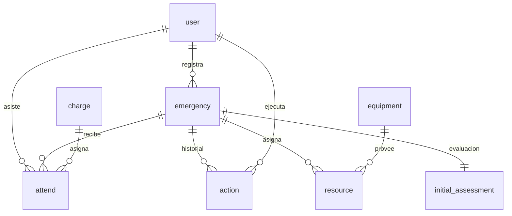
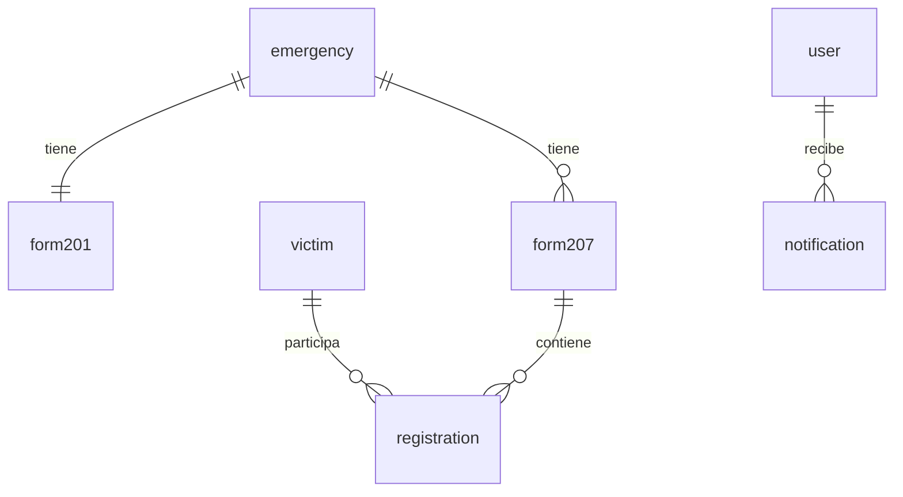
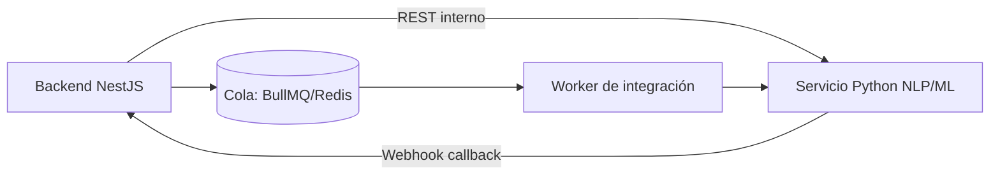

# Plan de Implementación del Sistema SCI

Este documento define el roadmap técnico detallado de desarrollo por fases, identificando dependencias entre módulos, el modelo de datos de las entidades críticas y el mapa estratégico de endpoints.

---

## 1. Roadmap de Desarrollo por Fases

El proyecto está diseñado para implementarse de forma iterativa y modular.

### Fase 1: Módulo de Captura de Emergencia y Soporte SCI (Fase Actual)
**Objetivo**: Implementar la infraestructura de seguridad, autenticación, inventario de equipamiento, catálogo de cargos y la apertura del incidente inicial con la evaluación preliminar.
* **Módulos Clave**:
  * **Autenticación**: Login robusto, JWT y validadores de tokens.
  * **Usuarios y Roles**: Gestión del personal y su nivel de acceso.
  * **Inventario**: Catálogo de equipos disponibles para respuesta.
  * **Estructura SCI**: Cargos operativos y su nivel de jerarquía.
  * **Apertura de Incidentes**: Creación de Emergencias, Evaluación Inicial (`initial_assessment`) e Historial de Acciones.
* **Entidades Relacionadas**: `UserEntity`, `AttendEntity`, `ChargeEntity`, `EquipmentEntity`, `ActionEntity`, `EmergencyEntity`, `ResourceEntity`, `InitialAssessmentEntity`.

### Fase 2: Formularios SCI y Trazabilidad de Recursos (Próxima Fase)
**Objetivo**: Implementar los formularios estándar del SCI (Form 201 y Form 207) y la asignación granular de recursos humanos y materiales.
* **Formulario 201**: Gestión de Objetivos, Estrategias, Tácticas, Mensajes de Seguridad y Organigrama.
* **Formulario 207 & Registro**: Triage de víctimas, transferencia a unidades médicas.
* **Control de Asignación**: Recursos materiales (`ResourceEntity`) vinculados a incidentes específicos.

### Fase 3: Predicciones Históricas y Módulo Forestal (Futuro)
**Objetivo**: Integración del módulo climatológico y de incendios forestales para análisis preventivo e histórico.
* **Dataset Forestal**: Migración de `DataFireEntity` a `dataset_fires` para persistencia histórica de temperatura, humedad, viento y causa del fuego.
* **Mapeo Avanzado**: Localizaciones de puesto comando y áreas de espera en mapa interactivo.

---

## 2. Modelo de Datos y Entidades Críticas (Fase 1)

Estructura de las tablas y campos recomendados para cumplir con las directrices del SCI:



### Tabla: `user` (UserEntity)
* `id` (UUID, PK)
* `name` (varchar(100))
* `last_name` (varchar(100))
* `email` (varchar(100), unique)
* `password` (varchar(255))
* `cellphone` (varchar(20), nullable)
* `grade` (varchar(50), nullable) - Rango jerárquico institucional
* `role` (enum: ROLES) - Rol de acceso al sistema (basic, advanced, manager, admin)
* `is_active` (boolean)
* `is_deleted` (boolean) - Soft delete
* `created_at` / `updated_at` (timestamps)

### Tabla: `charge` (ChargeEntity)
* `id` (UUID, PK)
* `name` (varchar(100)) - Nombre del cargo SCI (ej. "Comandante del Incidente")
* `system_name` (varchar(100), nullable) - Identificador interno para negocio (ej. "incident_commander")
* `level` (int) - Nivel jerárquico en la estructura SCI (1 a 5)
* `weight` (decimal) - Prioridad de peso interno
* `created_at` / `updated_at` (timestamps)

### Tabla: `attend` (AttendEntity)
* `id` (UUID, PK)
* `user_id` (UUID, FK -> user)
* `emergency_id` (UUID, FK -> emergency)
* `charge_id` (UUID, FK -> charge)
* `date` (date) - Fecha de asignación
* `hour` (time) - Hora de asignación
* `created_at` / `updated_at` (timestamps)

### Tabla: `emergency` (EmergencyEntity)
* `id` (UUID, PK)
* `code` (varchar(20), unique) - Codigo único de la emergencia con formato EMG-XXX
* `name` (varchar(100))
* `location_description` (varchar(255), nullable)
* `date` (date)
* `hour` (varchar(10))
* `type` (varchar(50))
* `coordinates` (simple-array) - Ubicación del incidente [lat, lng]
* `coordinates_pc` (simple-array) - Puesto de Comando [lat, lng]
* `coordinates_e` (simple-array) - Área de Espera/Staging [lat, lng]
* `state` (varchar(1)) - Estado (p: pendiente, a: activa, f: finalizada, c: cancelada)
* `duration` (varchar(50))
* `user_id` (UUID, FK -> user) - Usuario operador que abrió el incidente
* `initial_assessment_id` (UUID, FK -> initial_assessment) - Evaluación inicial del incidente
* `is_deleted` (boolean) - Soft delete
* `created_at` / `updated_at` (timestamps)

### Tabla: `initial_assessment` (InitialAssessmentEntity)
* `id` (UUID, PK)
* `hazard_type` (varchar(100)) - Tipo de peligro identificado
* `nature_of_incident` (varchar(100)) - Naturaleza del incidente
* `threats` (text) - Amenazas identificadas
* `affected_area` (varchar(100)) - Área afectada
* `isolation` (varchar(100)) - Aislamiento
* `severity_level` (varchar(20)) - Severidad (Bajo, Medio, Alto, Extremo)
* `affected_people_estimated` (varchar(255)) - Estimación inicial de personas afectadas
* `situation_description` (text) - Descripción detallada de la situación encontrada
* `weather_conditions` (varchar(100)) - Condiciones del clima (viento, lluvia, visibilidad)
* `created_at` / `updated_at` (timestamps)

### Tabla: `equipment` (EquipmentEntity)
* `id` (UUID, PK)
* `name` (varchar(100))
* `description` (text, nullable)
* `total_quantity` (int) - Inventario total
* `available_quantity` (int) - Inventario listo para despacho
* `is_deleted` (boolean) - Soft delete
* `created_at` / `updated_at` (timestamps)

### Tabla: `resource` (ResourceEntity)
* `id` (UUID, PK)
* `emergency_id` (UUID, FK -> emergency)
* `equipment_id` (UUID, FK -> equipment)
* `amount` (int) - Cantidad asignada al incidente
* `note` (varchar(255))
* `is_deleted` (boolean) - Soft delete
* `created_at` / `updated_at` (timestamps)

### Tabla: `action` (ActionEntity)
* `id` (UUID, PK)
* `description` (varchar(255)) - Descripción de la acción u bitácora
* `date` (date)
* `hour` (varchar(10))
* `emergency_id` (UUID, FK -> emergency)
* `user_id` (UUID, FK -> user) - Usuario que registró la acción
* `is_deleted` (boolean) - Soft delete
* `created_at` / `updated_at` (timestamps)

### Tabla: `audit_log` (AuditLogEntity)
* `id` (UUID, PK)
* `user_id` (UUID, FK -> user, nullable) - Usuario ejecutor (null si es del sistema/anónimo)
* `user_role` (varchar(50), nullable) - Rol del ejecutor en el momento de la transacción
* `event_type` (varchar(20)) - `CREATE` | `UPDATE` | `DELETE`
* `entity_name` (varchar(100)) - Nombre de la tabla/entidad (ej. "EmergencyEntity")
* `entity_id` (UUID) - ID de la fila afectada
* `old_values` (jsonb, nullable) - Snapshot de datos anterior a la modificación (null en CREATE)
* `new_values` (jsonb, nullable) - Snapshot de datos posterior a la modificación (null en DELETE)
* `ip_address` (varchar(45), nullable) - Dirección IP de origen de la transacción
* `created_at` (timestamp) - Fecha y hora del evento de auditoría

---

## 3. Mapa de Endpoints y Control de Acceso (Fase 1)

| Módulo | Endpoint | Método | Guard de Acceso | Rol Mínimo | Descripción |
| :--- | :--- | :---: | :--- | :---: | :--- |
| **Auth** | `/api/login` | `POST` | *Público* | - | Autenticación y generación de JWT |
| | `/api/checkToken` | `POST` | *Público* | - | Validación de vigencia del token |
| | `/api/reset-password` | `POST` | *Público* | - | Generación de código de restablecimiento de contraseña |
| | `/api/confirm-reset-password` | `POST` | *Público* | - | Confirmación de restablecimiento de contraseña |
| **User** | `/api/user` | `POST` | AuthGuard, RolesGuard | `MANAGER,ADMIN` | Crear un nuevo usuario |
| | `/api/user` | `GET` | AuthGuard, RolesGuard | `MANAGER,ADMIN` | Listar usuarios activos (paginado) |
| | `/api/user/me` | `GET` | AuthGuard | `BASIC` | Obtener perfil del usuario logueado |
| | `/api/user/me` | `PATCH` | AuthGuard | `BASIC` | Actualizar perfil del usuario logueado |
| | `/api/user/:id` | `PATCH` | AuthGuard | `ADMIN, MANAGER` | Actualizar datos del usuario |
| | `/api/user/status/:id` | `PATCH` | AuthGuard | `ADMIN, MANAGER` | Actualizar estado del usuario |
| | `/api/user/:id` | `DELETE` | AuthGuard, RolesGuard | `ADMIN` | Soft Delete de usuario |
| **Emergency**| `/api/emergency` | `POST` | AuthGuard, RolesGuard | `BASIC` | Declaración de incidente |
| | `/api/emergency` | `GET` | AuthGuard | `BASIC` | Listar emergencias |
| | `/api/emergency/:id`| `PATCH` | AuthGuard | `BASIC` | Modificar datos si no está finalizada |
| | `/api/emergency/:id`| `DELETE` | AuthGuard, RolesGuard | `ADMIN` | Soft delete de emergencia |
| **Assessment**| `/api/emergency/:id/assessment` | `POST` | AuthGuard | `BASIC` | Registrar la evaluación inicial |
| | `/api/emergency/:id/assessment` | `PATCH` | AuthGuard | `BASIC` | Modificar la evaluación inicial |
| **Attend** | `/api/attend` | `POST` | AuthGuard | `MANAGER,ADMIN` | Asignar personal y cargo SCI |
| | `/api/attend/:id` | `PATCH` | AuthGuard | `MANAGER,ADMIN` | Actualizar cargo de personal |
| | `/api/attend/:id` | `DELETE` | AuthGuard | `MANAGER,ADMIN` | Retirar personal asignado |
| **Action** | `/api/action` | `POST` | AuthGuard | `BASIC` | Registrar evento/bitácora en el incidente |
| **Equipment**| `/api/equipment` | `POST` | AuthGuard, RolesGuard | `MANAGER` | Agregar equipo al inventario |
| | `/api/equipment/:id` | `PATCH` | AuthGuard | `MANAGER` | Modificar equipo |
| | `/api/equipment/:id` | `DELETE` | AuthGuard, RolesGuard | `MANAGER` | Soft Delete de equipo |
| | `/api/equipment` | `GET` | AuthGuard | `BASIC` | Ver inventario de equipos |
| **Resource** | `/api/resource` | `POST` | AuthGuard | `BASIC` | Despachar recursos a una emergencia |
| | `/api/resource/:id/return` | `PATCH` | AuthGuard | `MANAGER,ADMIN` | Devolver recursos a una emergencia |

# Plan de Implementación del Sistema SCI — Detalle Fase 2 y Fase 3

Esta sección extiende el roadmap original, detallando el modelo de datos y el mapa de endpoints de las Fases 2 y 3, incorporando las reglas de continuidad operativa offline y control de concurrencia definidas en las Reglas de Implementación v2.

---

## FASE 2 — Formularios SCI, Trazabilidad de Recursos y Continuidad Offline

**Objetivo**: Permitir la gestión operativa completa de incidentes mediante formularios SCI (201 y 207) y garantizar la continuidad operativa incluso sin conexión.

**Tablas nuevas**: `form201`, `form207`, `victim`, `registration`, `notification`.

### 1. Modelo de Datos — Fase 2



#### Tabla: `form201` (Form201Entity)
Resumen del incidente: objetivos, estrategias, tácticas, mensaje de seguridad y organigrama.

* `id` (UUID, PK)
* `emergency_id` (UUID, FK -> emergency, **unique parcial** — ver constraint abajo)
* `code` (varchar(10)) — Correlativo del formulario (ej. `F201-001`)
* `date` (date) — Fecha del formulario (puede diferir de `created_at` si se completa en retrospectiva)
* `nature` (varchar(150)) — Naturaleza del incidente
* `thread` (text) — Amenaza(s) asociada(s) al incidente
* `affected_area` (varchar(255)) — Descripción del área afectada
* `communications_channel` (varchar(100)) — Canal/frecuencia de comunicaciones designado
* `entry_route` (varchar(255)) — Ruta de entrada/acceso al incidente
* `egress_route` (varchar(255)) — Ruta de salida/evacuación
* `affected_areas_map_url` (varchar(500), nullable) — URL/referencia al mapa de áreas afectadas
* `objectives` (text) — Objetivos del incidente
* `strategies` (text) — Estrategias generales
* `tactics` (text) — Tácticas específicas
* `safety_message` (varchar(500)) — Mensaje de seguridad para el personal
* `organization_chart` (jsonb) — Organigrama SCI (snapshot de cargos/usuarios asignados al momento de generar el F201; no depende en tiempo real de `attend` para preservar historial)
* `is_finalized` (boolean, default `false`)
* `client_generated_id` (UUID, unique, nullable) — Id generado en el dispositivo móvil para soporte offline (ver sección 4)
* `user_id` (UUID, FK -> user) — Quien lo creó/editó por última vez
* `is_deleted` (boolean) — Soft delete
* `created_at` / `updated_at` (timestamps)

**Constraint de exclusividad (retoma la regla v2, con liberación de slot al eliminar):**
```sql
CREATE UNIQUE INDEX uq_form201_active_per_emergency
ON form201 (emergency_id)
WHERE is_deleted = false;
```

#### Tabla: `form207` (Form207Entity)
Contenedor del registro de víctimas; se permite más de uno por emergencia.

* `id` (UUID, PK)
* `emergency_id` (UUID, FK -> emergency)
* `code` (varchar(10)) — Correlativo por emergencia (`F207-001`, `F207-002`, ...)
* `date` (date) — Fecha del formulario
* `is_finalized` (boolean, default `false`)
* `client_generated_id` (UUID, unique, nullable)
* `user_id` (UUID, FK -> user) — Quien lo abrió
* `is_deleted` (boolean) — Soft delete
* `created_at` / `updated_at` (timestamps)

**Correlativo sin condición de carrera:**
```sql
-- Contador atómico por emergencia (evita duplicar F207-00N bajo concurrencia)
CREATE TABLE emergency_form207_counter (
  emergency_id UUID PRIMARY KEY REFERENCES emergency(id),
  last_value INT NOT NULL DEFAULT 0
);
-- Uso: UPDATE emergency_form207_counter
--      SET last_value = last_value + 1
--      WHERE emergency_id = $1
--      RETURNING last_value;
```

#### Tabla: `victim` (VictimEntity)
Entidad independiente: representa a la víctima en sí, no depende de un F207 específico (puede aparecer registrada en más de un F207 a lo largo del tiempo, vía `registration`).

* `id` (UUID, PK)
* `identifier` (varchar(50), nullable) — Nombre o "NN" si no identificada
* `age_estimated` (int, nullable)
* `gender` (varchar(20), nullable)
* `cellphone` (varchar(20), nullable) — Teléfono de la víctima
* `reference_cellphone` (varchar(20), nullable) — Teléfono de un contacto de referencia/familiar
* `client_generated_id` (UUID, unique, nullable)
* `is_deleted` (boolean)
* `created_at` / `updated_at` (timestamps)

#### Tabla: `registration` (RegistrationEntity)
**Tabla intermedia** entre `victim` y `form207`: representa el hecho de que una víctima fue registrada/atendida dentro de un formulario 207 específico, con su clasificación de triage y datos de traslado en ese momento. Es un log **append-only** (no editable, sin soft delete), para preservar trazabilidad médico-legal — si la clasificación cambia, se crea una nueva entrada en vez de modificar la anterior.

* `id` (UUID, PK)
* `victim_id` (UUID, FK -> victim)
* `form207_id` (UUID, FK -> form207)
* `classification` (enum: `rojo`, `amarillo`, `verde`, `negro`) — Valor del triage (START/SALT) en este registro
* `transferred_by` (varchar(150), nullable) — Quién/qué unidad realizó el traslado
* `cellphone_transfer_manager` (varchar(20), nullable) — Teléfono de quien gestiona/realiza el traslado
* `notes` (varchar(500), nullable)
* `user_id` (UUID, FK -> user) — Quien registró el evento
* `date` (date)
* `hour` (varchar(10))
* `client_generated_id` (UUID, unique, nullable)
* `created_at` (timestamp) — Sin `updated_at`/soft delete: es un log inmutable

#### Tabla: `notification` (NotificationEntity)

* `id` (UUID, PK)
* `user_id` (UUID, FK -> user) — Destinatario (única relación de esta tabla)
* `type` (enum: `ci_change`, `form_finalized`, `emergency_state_change`, `sync_conflict`, `resource_assigned`)
* `title` (varchar(100))
* `message` (varchar(255))
* `is_read` (boolean, default `false`)
* `created_at` (timestamp)

Las notificaciones se generan automáticamente desde los servicios de dominio (ej. al cambiar de CI, al finalizar una emergencia) y se entregan por dos canales:
* **WebSocket** (`NotificationsGateway` de NestJS) para clientes conectados, con salas por `emergency_id` y por `user_id`.
* **Push notification** (FCM para Android/iOS) para la app móvil cuando el usuario no tiene la app en primer plano — necesario dado que el personal de campo puede estar con la pantalla apagada.

### 2. Continuidad Operativa Offline (aplicado a Fase 2)

Las tablas `form201`, `form207`, `victim` y `registration` son las que el personal de campo diligencia activamente sin conexión, por lo que todas incorporan:

* **`client_generated_id`**: UUID generado en el dispositivo al crear el registro offline. Es la clave de deduplicación al sincronizar (índice único).
* **Endpoint de sincronización por lote** (`POST /api/sync/batch`): recibe un arreglo de operaciones pendientes (`create`/`update` con su `client_generated_id`, entidad y payload) en orden cronológico, y las aplica de forma idempotente. Si un `client_generated_id` ya existe, se ignora silenciosamente (ya sincronizado en un intento anterior) y se responde `200` igual.
* **Conflictos**: si al sincronizar una operación la emergencia ya está `Finalizada` o `Cancelada`, se rechaza con código `SYNC_CONFLICT_EMERGENCY_CLOSED` y se genera una `notification` tipo `sync_conflict` para que el usuario revise manualmente el registro no aplicado (no se descarta silenciosamente).
* **`registration` no se edita**: al ser append-only, no genera conflictos de "última escritura gana"; el peor caso es un evento duplicado, ya evitado por `client_generated_id`.

### 3. Mapa de Endpoints — Fase 2

| Módulo | Endpoint | Método | Guard | Rol Mínimo | Descripción |
| :--- | :--- | :---: | :--- | :---: | :--- |
| **Form201** | `/api/emergency/:id/form201` | `POST` | AuthGuard | `BASIC` | Crear F201 (rechaza si ya existe uno activo) |
| | `/api/emergency/:id/form201` | `GET` | AuthGuard | `BASIC` | Obtener F201 activo de la emergencia |
| | `/api/form201/:id` | `PATCH` | AuthGuard | `BASIC` | Editar F201 (rechaza si `is_finalized` o emergencia finalizada) |
| | `/api/form201/:id/finalize` | `PATCH` | AuthGuard | `BASIC` | Marcar F201 como finalizado |
| | `/api/form201/:id` | `DELETE` | AuthGuard, RolesGuard | `MANAGER` | Soft delete (libera slot para nuevo F201) |
| **Form207** | `/api/emergency/:id/form207` | `POST` | AuthGuard | `BASIC` | Crear F207 (genera código correlativo) |
| | `/api/emergency/:id/form207` | `GET` | AuthGuard | `BASIC` | Listar F207 de la emergencia |
| | `/api/form207/:id/finalize` | `PATCH` | AuthGuard | `BASIC` | Marcar F207 como finalizado |
| **Victim** | `/api/victim` | `POST` | AuthGuard | `BASIC` | Crear víctima (entidad independiente) |
| | `/api/victim/:id` | `GET` | AuthGuard | `BASIC` | Obtener datos base de la víctima |
| | `/api/victim/:id` | `PATCH` | AuthGuard | `BASIC` | Editar datos base de la víctima |
| **Registration**| `/api/form207/:id/registration` | `POST` | AuthGuard | `BASIC` | Vincular una víctima a un F207 con su clasificación de triage (crea entrada en `registration`) |
| | `/api/form207/:id/registration` | `GET` | AuthGuard | `BASIC` | Listar víctimas registradas en ese F207 |
| | `/api/victim/:id/registration` | `GET` | AuthGuard | `BASIC` | Historial de registros de una víctima (si aparece en más de un F207) |
| **Notification**| `/api/notification` | `GET` | AuthGuard | `BASIC` | Listar notificaciones del usuario autenticado |
| | `/api/notification/:id/read` | `PATCH` | AuthGuard | `BASIC` | Marcar notificación como leída |
| **Sync** | `/api/sync/batch` | `POST` | AuthGuard | `BASIC` | Sincronizar cola de operaciones offline del dispositivo |

---

## FASE 3 — Procesamiento de Lenguaje Natural y Analítica Predictiva

**Objetivo**: Incorporar PLN y analítica predictiva para automatizar el registro de información y generar análisis predictivo para la toma de decisiones.

**Tabla nueva**: `dataset_incendio`.

**Nota de arquitectura**: el procesamiento de lenguaje natural y la analítica predictiva viven en un **servicio Python separado** (microservicio independiente del monolito NestJS), lo cual tiene implicancias de diseño que se detallan abajo.

### 1. Modelo de Datos — Fase 3

#### Tabla: `dataset_incendio` (DatasetIncendioEntity)

* `id` (UUID, PK)
* `emergency_id` (UUID, FK -> emergency, nullable) — nullable porque puede cargarse data histórica no asociada a una emergencia del sistema
* `date` (date) — Fecha del registro/evento
* `month` (int) — Mes (1-12), desnormalizado desde `date` para facilitar agregaciones estacionales en el análisis predictivo
* `type_fire` (varchar(50), nullable) — Tipo de incendio (ej. forestal, superficial, de copa)
* `level_risk` (varchar(20), nullable) — Nivel de riesgo asociado (ej. bajo, medio, alto, extremo)
* `temperature` (decimal) — Temperatura (°C)
* `humidity` (decimal) — Humedad relativa (%)
* `wind_speed` (decimal) — Velocidad del viento (km/h)
* `wind_direction` (varchar(10), nullable) — Dirección del viento (N, NE, SE, etc.)
* `cause` (varchar(100), nullable) — Causa identificada del incendio
* `coordinates` (simple-array, nullable) — [lat, lng]
* `area_affected_ha` (decimal, nullable) — Hectáreas afectadas
* `nvdi` (decimal, nullable) — Índice de vegetación (NDVI) obtenido por sensoramiento remoto
* `ndmi` (decimal, nullable) — Índice de humedad de la vegetación (NDMI) obtenido por sensoramiento remoto
* `source` (enum: `manual`, `nlp_extracted`, `sensor`) — Origen del dato
* `confidence_score` (decimal, nullable) — Score de confianza del modelo (0-1), solo aplica si `source = nlp_extracted`
* `is_validated` (boolean, default `false`) — Si un usuario humano confirmó el dato extraído por NLP (ver regla de validación abajo)
* `validated_by` (UUID, FK -> user, nullable)
* `is_deleted` (boolean)
* `created_at` / `updated_at` (timestamps)

**Regla de negocio crítica — validación humana obligatoria:**
Los datos con `source = nlp_extracted` **no deben usarse en reportes oficiales ni en el modelo predictivo de reentrenamiento** hasta que `is_validated = true`. Esto evita que errores de extracción automática contaminen silenciosamente el histórico usado para decisiones operativas. El servicio Python solo debe recibir para reentrenamiento registros con `is_validated = true`.

### 2. Arquitectura de Integración con el Servicio Python



* **Comunicación**: REST interno sobre red privada (no expuesto públicamente), autenticado con API key de servicio o mTLS — nunca con las credenciales JWT de usuarios finales.
* **Procesamiento asíncrono**: dado que el PLN/ML puede tardar (segundos a minutos), NestJS **no debe bloquear** la request del usuario esperando la respuesta del servicio Python. Flujo recomendado:
  1. El usuario registra una `action` (bitácora en texto libre) o sube un reporte.
  2. NestJS encola un job (`BullMQ`/Redis) con el texto a procesar.
  3. Un worker envía el texto al servicio Python (`POST /nlp/extract`).
  4. El servicio Python responde de forma asíncrona vía **webhook** (`POST /api/internal/nlp-callback`) con las entidades extraídas (temperatura, causa, coordenadas, etc.) y su `confidence_score`.
  5. NestJS crea el registro en `dataset_incendio` con `source = nlp_extracted`, `is_validated = false`, y genera una `notification` al usuario/rol correspondiente para que revise y valide el dato.
* **Resiliencia**: si el servicio Python está caído o no responde, el flujo operativo del SCI (creación de emergencias, formularios, recursos) **no debe verse afectado en absoluto** — el PLN es una capacidad adicional, no una dependencia dura. El job simplemente queda reintentando en la cola con backoff exponencial.
* **Contrato de datos**: se define un esquema versionado (ej. JSON Schema `nlp-extraction-v1`) para la entrada/salida entre NestJS y Python, de forma que cambios en el modelo ML no rompan al backend silenciosamente; el backend valida la respuesta contra el schema antes de persistir.
* **Analítica predictiva**: expuesta como endpoint de solo lectura consumido por NestJS bajo demanda (ej. "riesgo de incendio próximos 7 días por zona"), cacheado con TTL corto (no se recalcula en cada request), y presentado en el mapa interactivo mencionado en la Fase 3 del roadmap original.

### 3. Mapa de Endpoints — Fase 3

| Módulo | Endpoint | Método | Guard | Rol Mínimo | Descripción |
| :--- | :--- | :---: | :--- | :---: | :--- |
| **DatasetIncendio** | `/api/dataset-incendio` | `POST` | AuthGuard, RolesGuard | `MANAGER` | Carga manual de registro histórico |
| | `/api/dataset-incendio` | `GET` | AuthGuard | `BASIC` | Listar/filtrar dataset (paginado) |
| | `/api/dataset-incendio/:id/validate` | `PATCH` | AuthGuard, RolesGuard | `MANAGER` | Validar un registro `nlp_extracted` |
| **NLP (interno)** | `/api/internal/nlp-callback` | `POST` | ServiceAuthGuard (API key) | - | Webhook de recepción de resultados del servicio Python |
| **Predicción** | `/api/prediction/risk-map` | `GET` | AuthGuard | `BASIC` | Consulta de zonas de riesgo (cacheado) |

### 4. Pruebas de Integración Adicionales (Fase 2 y 3)

* Sincronización offline: enviar el mismo lote dos veces (simulando reintento de red) y verificar que no se dupliquen `form207`/`victim`/`registration`.
* Conflicto de sincronización: sincronizar una acción sobre una emergencia ya finalizada y verificar que se genere la `notification` tipo `sync_conflict` en vez de perder el dato.
* Correlativo de F207 bajo concurrencia (ya cubierto en v2, se reutiliza con la tabla `emergency_form207_counter`).
* Resiliencia del flujo NLP: simular caída del servicio Python (timeout/500) y verificar que la creación de `action`/`emergency` no falle ni se bloquee, y que el job quede en la cola para reintento.
* Validación obligatoria: verificar que un registro `dataset_incendio` con `is_validated = false` no aparezca en el payload que se envía al servicio Python para reentrenamiento.