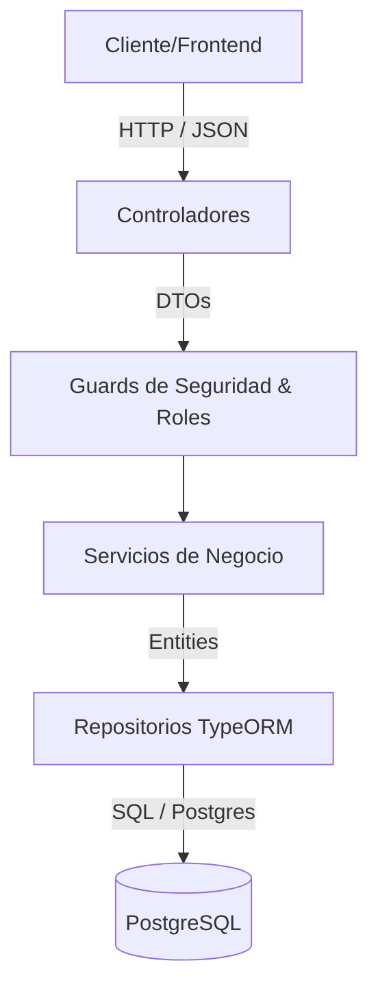

# Reglas de Implementación y Arquitectura del Sistema SCI

Este documento define la arquitectura de software, patrones de diseño, estándares de código, reglas de dominio específicas del Sistema de Comando de Incidentes (SCI) y las directrices de seguridad para garantizar la escalabilidad, mantenibilidad y robustez de la aplicación.

Versión revisada que incorpora control de concurrencia, máquina de estados explícita, estrategia offline para móvil, hashing con bcrypt, observabilidad (logging estructurado, métricas y alertas) y pruebas de integración.


---

## 1. Arquitectura y Patrones de Diseño

El sistema está construido bajo la arquitectura **Modular de NestJS** y el patrón **Repository** utilizando **TypeORM** para interactuar con PostgreSQL.



### Principios SOLID Aplicados
1. **S - Single Responsibility Principle (SRP)**: Cada clase tiene una única responsabilidad. Los controladores solo manejan solicitudes HTTP, los servicios resuelven la lógica de negocio y las entidades representan la persistencia.
2. **O - Open/Closed Principle (OCP)**: Diseño extensible. Por ejemplo, en el módulo de emergencias se puede extender la información histórica mediante patrones específicos por tipo (como la migración de `DataFireEntity` a `dataset_fires` para incendios forestales e interfaces sin alterar la entidad base `EmergencyEntity`).
3. **L - Liskov Substitution Principle (LSP)**: Todas las entidades extienden de una entidad base abstracta `BaseEntity` compartiendo atributos comunes como `id`, `created_at` y `updated_at`.
4. **I - Interface Segregation Principle (ISP)**: Tipado segregado en interfaces específicas como `IAuth`, `ILoginResponse`, `IPayload` y `IUserToken`.
5. **D - Dependency Inversion Principle (DIP)**: Inyección de dependencias nativa de NestJS. Los servicios dependen de abstracciones (ej. interfaces de estrategias de token `ITokenStrategy`).

### Patrones de Diseño
* **Strategy Pattern**: Utilizado en el subsistema de autenticación para la validación de tokens (`ITokenStrategy` y su implementación concreta `JwtStrategy`).
* **Data Transfer Object (DTO)**: Garantiza la validación estricta y tipado de entrada (`class-validator` y `class-transformer`) desacoplando la capa de transporte de datos de la capa del modelo.
* **Repository Pattern**: Centraliza la lógica de persistencia abstrayendo el acceso a datos.

**Nota de precisión sobre SOLID**: el ejemplo de LSP debe entenderse como reutilización de estructura vía `BaseEntity` (herencia de campos comunes), no como sustituibilidad de comportamiento en sentido estricto. Si se desea un ejemplo genuino de LSP, debe documentarse un caso donde una subclase de servicio/estrategia pueda reemplazar a su clase base sin alterar el comportamiento esperado por el cliente (por ejemplo, distintas `ITokenStrategy` intercambiables sin que el `AuthService` cambie su lógica).

Se mantiene TypeORM **sin migraciones versionadas** (uso de `synchronize` en los entornos definidos por el equipo), según decisión del proyecto.

### 1.1 `BaseEntity` — Entidad base abstracta

Todas las entidades operativas del sistema **deben** extender de la clase abstracta `BaseEntity` ubicada en `src/common/entities/base.entity.ts`. Esta clase centraliza los atributos comunes que se repiten en todas las tablas, garantizando consistencia y eliminando duplicación.

**Atributos obligatorios de `BaseEntity`:**

| Atributo | Tipo | Columna DB | Decorador TypeORM | Descripción |
|:---|:---|:---|:---|:---|
| `id` | `string` | `id` (UUID) | `@PrimaryGeneratedColumn('uuid')` | Identificador único universal, clave primaria |
| `isDeleted` | `boolean` | `is_deleted` | `@Column({ default: false })` | Bandera de Soft Delete. `true` = registro eliminado lógicamente |
| `createdAt` | `Date` | `created_at` | `@CreateDateColumn({ type: 'timestamp' })` | Fecha y hora de creación del registro (automática) |
| `updatedAt` | `Date` | `updated_at` | `@UpdateDateColumn({ type: 'timestamp' })` | Fecha y hora de última actualización (automática) |

**Estructura esperada:**

```typescript
import { Column, CreateDateColumn, PrimaryGeneratedColumn, UpdateDateColumn } from 'typeorm';

export abstract class BaseEntity {
  @PrimaryGeneratedColumn('uuid')
  id: string;

  @Column({ name: 'is_deleted', type: 'boolean', default: false })
  isDeleted: boolean;

  @CreateDateColumn({ type: 'timestamp', name: 'created_at' })
  createdAt: Date;

  @UpdateDateColumn({ type: 'timestamp', name: 'updated_at' })
  updatedAt: Date;
}
```

**Reglas de uso:**

1. **Ninguna entidad operativa** debe definir sus propios campos `id`, `isDeleted`, `createdAt` o `updatedAt` — los hereda de `BaseEntity`.
2. Si una entidad ya tiene un campo propio como `is_deleted` (ej. `UserEntity`), debe **eliminarse** y dejarse que lo herede de `BaseEntity`.
3. Las entidades que son **logs inmutables** (ej. `AuditLogEntity`, `RegistrationEntity`) pueden no heredar de `BaseEntity` si no aplican todos los campos (por ejemplo, no necesitan `updatedAt` ni `isDeleted`). En ese caso, definen sus propios campos mínimos (`id`, `createdAt`).
4. Todas las consultas `find` deben incluir implícita o explícitamente el filtro `is_deleted = false` para excluir registros eliminados lógicamente.

---

## 2. Reglas del Dominio SCI (Sistema de Comando de Incidentes)

El SCI requiere una estructura jerárquica clara, modularidad en operaciones y trazabilidad absoluta.

### Cadena de Mando y Asignación de Cargos
* **Separación de Capas**: Los **ROLES** del sistema (`BASIC`, `ADVANCED`, `MANAGER`, `ADMIN`) controlan el acceso técnico a los endpoints de la API. Los **CHARGES** (Cargos) del SCI (`Comandante del Incidente`, `Jefe de Operaciones`, etc.) se asignan dinámicamente a nivel operativo por cada emergencia mediante `AttendEntity`.
* **Identificación del Comandante del Incidente (CI)**: El Cargo de "Comandante del Incidente" debe poseer una propiedad interna (`system_name: 'incident_commander'`) a nivel de base de datos para identificarlo por código. Solo puede existir un único CI activo por emergencia.
* **Traspaso de Comando**: Para delegar el comando del incidente a otro usuario se requiere una acción formal de traspaso.
  * **Regla de Negocio**: Antes de realizar el traspaso de comando, los formularios 201 y 207 activos (si los hubiera) deben estar obligatoriamente en estado finalizado (`is_finalized: true`).
  * **Historial**: El traspaso debe registrar una entrada en el historial de acciones (`ActionEntity`) detallando la hora, el comandante saliente y el comandante entrante.

### 2.1 Cadena de Mando y Asignación de Cargos

* **Separación de Capas**: los **ROLES** (`BASIC`, `ADVANCED`, `MANAGER`, `ADMIN`) controlan acceso técnico a endpoints. Los **CHARGES** del SCI se asignan dinámicamente por emergencia mediante `AttendEntity`.
* **Prioridad y Override del Comandante del Incidente (CI)**: Si un usuario con rol de sistema `BASIC` tiene asignado activamente el cargo de "Comandante del Incidente" (`system_name: 'incident_commander'`) en una emergencia en curso, adquiere privilegios de edición en esa emergencia específica, asimilándose temporalmente a los roles `MANAGER` o `ADMIN`.
* **Privacidad del Administrador**: El usuario con rol `ADMIN` (administrador del sistema) debe ser excluido explícitamente en todas las consultas y listados de usuarios de cara a la interfaz para proteger el acceso prioritario al sistema.
* **Identificación del Comandante del Incidente (CI)**: el Cargo "Comandante del Incidente" posee `system_name: 'incident_commander'` a nivel de base de datos.
* **Tabla y Flujo de Auditoría Global**: Para garantizar la trazabilidad operacional de los datos del sistema, se debe registrar en una tabla específica toda operación de creación, actualización y eliminación. Contendrá quién realizó el cambio, su rol, tipo de evento (`CREATE`, `UPDATE`, `DELETE`), entidad afectada, `old_values` y `new_values`. Se implementará mediante interceptores de NestJS o suscriptores de eventos de TypeORM.

**Control de unicidad del CI activo (corrección de concurrencia):**
La validación de "solo un CI activo por emergencia" **no debe delegarse únicamente al servicio** (`if` + `save`), ya que dos solicitudes concurrentes pueden pasar la validación antes de que la primera se persista, generando dos CI activos simultáneos.

```sql
-- Índice único parcial en PostgreSQL
CREATE UNIQUE INDEX uq_attend_incident_commander_active
ON attend_entity (emergency_id)
WHERE charge_system_name = 'incident_commander' AND is_active = true;
```

El servicio debe capturar la violación de este constraint (`QueryFailedError`, código `23505`) y traducirla a una excepción de negocio (`ConflictException`), en lugar de confiar solo en una verificación previa.

**Traspaso de Comando (transaccional):**
El traspaso completo (validar formularios finalizados → desactivar CI saliente → activar CI entrante → registrar en `ActionEntity`) debe ejecutarse dentro de una **transacción de base de datos** usando `QueryRunner` de TypeORM, para garantizar atomicidad:

```typescript
const queryRunner = dataSource.createQueryRunner();
await queryRunner.connect();
await queryRunner.startTransaction();
try {
  // 1. Validar F201/F207 activos con is_finalized: true
  // 2. Desactivar AttendEntity del CI saliente
  // 3. Activar/crear AttendEntity del CI entrante
  // 4. Registrar ActionEntity (hora, comandante saliente, comandante entrante)
  await queryRunner.commitTransaction();
} catch (err) {
  await queryRunner.rollbackTransaction();
  throw err;
} finally {
  await queryRunner.release();
}
```

* **Regla de Negocio**: antes del traspaso, los formularios 201 y 207 activos (si existen) deben estar en `is_finalized: true`.
* **Historial**: el traspaso registra en `ActionEntity` la hora, el comandante saliente y el comandante entrante.


### Formularios y Control del Estado
* **Formulario 201 (Resumen del Incidente)**: 
  * Al crearse una emergencia, se debe generar automáticamente un Formulario 201 por defecto.
  * **Regla de Exclusividad**: Solo puede existir un formulario 201 a la vez asociado a la emergencia (si ya hay uno activo, no se permite crear otro).
* **Formulario 207 (Registro de Víctimas)**: 
  * Se permite la creación de múltiples formularios 207 en base al desarrollo operativo.
  * **Identificación Visual**: Cada formulario 207 debe incluir un código correlativo único por emergencia (ej. `F207-001`, `F207-002`) para su fácil reconocimiento en el frontend.
* **Control de Estado de la Emergencia**:
  * **Estados**: Pendiente (`p`), Activa (`a`), Finalizada (`f`), Cancelada (`c`).
  * **Transición**: 
    * Si pasa a **Cancelada**, se debe ingresar obligatoriamente un motivo de cancelación y guardarse en `ActionEntity`.
    * Si pasa a **Activa**, se registra la fecha y hora de activación en `ActionEntity`.
    * Si pasa a **Finalizada**, se deben validar que todos los formularios de la emergencia estén finalizados (`is_finalized: true`) y se registra en `ActionEntity`.
  * **Bloqueo**: Una vez que la emergencia está **Finalizada**, no se permite ninguna edición de datos de la emergencia ni de sus recursos asociados. En caso de requerir correcciones, el administrador puede reabrirla pasando el estado a **Activa** de nuevo, lo cual registrará la acción pertinente.

### 2.2 Formularios y Control del Estado

**Formulario 201 (Resumen del Incidente):**
* Se genera automáticamente al crear una emergencia.
* **Regla de Exclusividad**: solo puede existir un F201 activo (`is_deleted: false`) por emergencia.
* **Liberación de slot**: si el F201 activo se elimina (soft delete, `is_deleted: true`), el slot queda libre y se permite crear un nuevo F201 para esa emergencia. El constraint de unicidad debe considerar esto explícitamente:

```sql
CREATE UNIQUE INDEX uq_form201_active_per_emergency
ON form_201_entity (emergency_id)
WHERE is_deleted = false;
```

Igual que con el CI, el servicio debe manejar la posible colisión (`23505`) devolviendo un error de negocio claro ("Ya existe un Formulario 201 activo para esta emergencia").

**Formulario 207 (Registro de Víctimas):**
* Se permiten múltiples F207 por emergencia.
* **Código correlativo**: `F207-001`, `F207-002`, etc. **No debe calcularse con `COUNT(*) + 1`** en el servicio, porque dos inserciones concurrentes pueden generar el mismo correlativo. Opciones recomendadas:
  * Secuencia de PostgreSQL por emergencia (tabla auxiliar `emergency_sequence` con `UPDATE ... RETURNING` atómico), o
  * `SELECT ... FOR UPDATE` sobre un contador en `EmergencyEntity` dentro de una transacción antes de generar el correlativo.

### 2.3 Máquina de Estados de la Emergencia

Se define explícitamente qué transiciones son válidas, en lugar de permitir cualquier combinación no prohibida:

| Desde \ Hacia | Pendiente (p) | Activa (a) | Finalizada (f) | Cancelada (c) |
|---|---|---|---|---|
| **Pendiente (p)** | — | ✅ | ❌ | ✅ |
| **Activa (a)** | ❌ | ✅ (reapertura) | ✅ (con validación) | ✅ |
| **Finalizada (f)** | ❌ | ✅ (solo ADMIN, reapertura) | — | ❌ |
| **Cancelada (c)** | ❌ | ❌ | ❌ | — |

Reglas asociadas:
* **`p → a`**: se registra fecha/hora de activación en `ActionEntity`.
* **`* → c`**: requiere motivo de cancelación obligatorio, guardado en `ActionEntity`. Una emergencia **Cancelada** es un estado terminal (no transiciona a ningún otro estado).
* **`a → f`**: se valida que **todos** los formularios asociados (F201 y F207 activos) tengan `is_finalized: true`; si no, se rechaza con `BadRequestException` listando los formularios pendientes.
* **`f → a`**: solo permitido a usuarios con rol `ADMIN`; se registra la reapertura en `ActionEntity` (usuario, hora, motivo opcional).
* Cualquier transición no listada en la tabla debe rechazarse explícitamente con un mensaje indicando las transiciones válidas desde el estado actual. Se recomienda implementar esto como un mapa de transiciones permitidas en el servicio (`EmergencyStateMachine`), no como una cadena de `if/else`.

**Bloqueo en estado Finalizada**: no se permite edición de la emergencia ni de recursos asociados salvo la reapertura por ADMIN descrita arriba.

### 2.4 Modo Offline (Aplicación Móvil)

Dado que la app móvil se usa en campo con conectividad intermitente, se definen las siguientes reglas:

* **Cola de sincronización local**: las acciones críticas (crear/actualizar F207, registrar recursos, acciones de `ActionEntity`) se almacenan en una cola local (SQLite/WatermelonDB u similar) cuando no hay conexión, con estado `pending_sync`.
* **Identificadores generados en cliente**: los registros creados offline usan UUID generado en el dispositivo (no autoincremental de base de datos), para evitar colisiones al sincronizar.
* **Reconciliación al reconectar**: al recuperar conexión, la cola se envía en orden cronológico. El backend debe ser **idempotente** ante reintentos (usar el UUID del cliente como clave de deduplicación, ej. columna `client_generated_id` con índice único).
* **Conflictos de estado**: si un recurso fue modificado en el servidor mientras el dispositivo estaba offline (ej. la emergencia pasó a Finalizada), la sincronización de esa acción debe rechazarse con un código específico (`SYNC_CONFLICT_EMERGENCY_CLOSED`) y quedar visible en el cliente para revisión manual, no perderse silenciosamente.
* **Indicador visual**: la UI móvil debe mostrar claramente qué registros están `pending_sync` vs `synced`.


---

## 3. Estructura Estándar de Respuestas y Errores

Todos los controladores del sistema deben responder de forma consistente utilizando una interfaz estructurada y genérica.

### Estructura de Respuesta Exitosa (`ApiResponse<T>`)
```typescript
export interface ApiResponse<T> {
  success: true;
  statusCode: number;
  message?: string;
  data: T;
  meta?: {
    total: number;
    limit: number;
    offset: number;
  };
}
```

### Estructura de Respuesta de Error
Se añade un campo de trazabilidad:

```typescript
export interface ApiErrorResponse {
  success: false;
  statusCode: number;
  message: string | string[];
  error: string;
  timestamp: string;
  path: string;
  traceId: string; // correlaciona con logs estructurados (ver sección 5)
}
```

---

## 4. Guías de Código Seguro y Seguridad de Datos

### Validación y Control de Entradas (Seguridad contra Inyección SQL y XSS)
* **Whitelist en Query DTO**: Para prevenir vulnerabilidades de inyección SQL a través del parámetro dinámico `attr` en el QueryBuilder de TypeORM, se debe validar contra una lista blanca (whitelist) de propiedades permitidas de la entidad en cuestión.

*(Se mantiene whitelist de atributos en QueryBuilder, sanitización de DTOs, `ParseUUIDPipe`, principio de privacidad por defecto con `AuthGuard`/`RolesGuard`, y Soft Delete global.)*

### 4.1 Hashing de Contraseñas

* Uso de **bcrypt** (`bcryptjs` o `bcrypt` nativo) con un costo (`salt rounds`) mínimo de 10-12, ajustable según capacidad del servidor.
* Nunca se almacena ni se loguea la contraseña en texto plano, incluso en logs de error.


```typescript
const hashedPassword = await bcrypt.hash(plainPassword, 12);
const isValid = await bcrypt.compare(plainPassword, user.password);
```

```
  // Ejemplo de mitigación conceptual en servicios
  const allowedAttributes = ['name', 'email', 'is_active'];
  if (attr && !allowedAttributes.includes(attr)) {
    throw new BadRequestException('Atributo de ordenamiento/búsqueda no permitido.');
  }
  ```
* **Tipado Seguro**: Todos los inputs de cadena de texto de DTOs deben ser sanitizados contra scripts o tags HTML peligrosos (`class-validator` con saneamiento básico o librerías de sanitización tipo DOMPurify/validator).
* **Parámetros Numéricos**: Forzar la conversión y validación implícita de IDs UUID y números en paginaciones (`ParseUUIDPipe`, `@Type(() => Number)`).

### Estandarización de Seguridad (Guards y Rutas Privadas)
* **Principio de Privacidad por Defecto**: Todas las rutas de la aplicación son protegidas por defecto usando `@UseGuards(AuthGuard, RolesGuard)`. Los únicos endpoints públicos permitidos son `/login` y el flujo de recuperación de contraseña.
* **Soft Delete Global**: Para mantener la integridad referencial histórica del SCI, ninguna entidad operativa debe utilizar hard delete (`DELETE` físico en la base de datos). Se debe implementar Soft Delete (`is_deleted: true` o `@DeleteDateColumn` de TypeORM) en todas las tablas (`EmergencyEntity`, `Form201Entity`, `Form207Entity`, `ResourceEntity`, etc.).

* Las contraseñas deben excluirse explícitamente de las respuestas de la API (`@Exclude()` de `class-transformer` en la entidad `UserEntity`).

### 4.2 Tokens y Sesión

* JWT de acceso de corta duración + refresh token con rotación (se invalida el anterior al emitir uno nuevo).
* Rate limiting (`@nestjs/throttler`) en `/login` y `/refresh-token` para mitigar fuerza bruta.

---

## 5. Observabilidad: Logging Estructurado, Métricas y Alertas

### 5.1 Logging Estructurado

* Todos los logs se emiten en formato **JSON** (no texto plano), usando una librería como `nestjs-pino` o `winston` con formato JSON.
* Cada entrada de log debe incluir como mínimo: `timestamp`, `level`, `traceId`, `userId` (si aplica), `module`, `message`, y contexto relevante (ej. `emergencyId`, `formId`).
* El `traceId` se genera por request (middleware) y se propaga a través de servicios, permitiendo correlacionar todos los logs de una misma operación, incluyendo el que se devuelve en `ApiErrorResponse`.
* **Nunca** se loguean datos sensibles: contraseñas, tokens completos (solo hash o los últimos 4 caracteres), datos personales de víctimas más allá de lo estrictamente necesario para depuración.
* Eventos de dominio críticos se loguean explícitamente como eventos de auditoría (nivel `info` o `audit`): cambios de CI, transiciones de estado de emergencia, cancelaciones, reaperturas.

### 5.2 Métricas

* Exposición de métricas en formato Prometheus (`/metrics`) usando `@willsoto/nestjs-prometheus` o similar.
* Métricas mínimas recomendadas:
  * Contadores: emergencias creadas, activadas, finalizadas, canceladas; traspasos de comando; formularios creados/finalizados.
  * Histogramas: latencia de endpoints críticos (creación de emergencia, traspaso de comando, sincronización offline).
  * Gauge: emergencias activas en tiempo real, usuarios conectados.
  * Tasa de errores por endpoint y por código HTTP (4xx vs 5xx, separados).

### 5.3 Alertas

* Alertas basadas en las métricas anteriores, integradas con la herramienta de monitoreo del equipo (ej. Grafana Alerting, PagerDuty, o similar):
  * Tasa de error 5xx superior a un umbral en ventana de 5 minutos.
  * Latencia p95 de endpoints críticos por encima de un umbral definido.
  * Fallos repetidos de sincronización offline (posible indicio de bug en reconciliación).
  * Ausencia de heartbeat/health-check del servicio (endpoint `/health`).
* Las alertas de dominio (no solo técnicas) también son relevantes: por ejemplo, una emergencia activa sin CI asignado por más de X minutos podría alertar a nivel operativo.

---

## 6. Pruebas Unitarias y de Integración

### 6.1 Pruebas Unitarias (Jest)

Se mantiene lo definido en v1:
* No se puede traspasar el comando si hay formularios pendientes de finalizar.
* La transición a "Finalizada" falla si existen formularios activos sin cerrar.
* No se pueden modificar recursos en una emergencia "Finalizada".
* Validación de la máquina de estados: transiciones no permitidas deben ser rechazadas (tabla completa de la sección 2.3).

### 6.2 Pruebas de Integración

Ejecutadas contra una base de datos real (PostgreSQL de test, vía Docker/Testcontainers), cubriendo escenarios que las pruebas unitarias no pueden validar por sí solas:

* **Concurrencia en creación de F201**: disparar dos requests simultáneas de creación de F201 para la misma emergencia y verificar que solo una tenga éxito y la otra reciba `ConflictException`.
* **Concurrencia en asignación de CI**: disparar dos requests simultáneas de asignación de CI y verificar que el índice único parcial impida duplicados.
* **Concurrencia en correlativo de F207**: crear N formularios 207 en paralelo para la misma emergencia y verificar que todos los códigos correlativos sean únicos y consecutivos, sin colisiones.
* **Transacción de traspaso de comando**: forzar un error a mitad del traspaso (ej. fallo al escribir `ActionEntity`) y verificar que la transacción completa haga rollback (el CI saliente sigue activo, no queda estado intermedio inconsistente).
* **Liberación de slot F201 tras soft delete**: eliminar (soft delete) el F201 activo de una emergencia y verificar que inmediatamente se puede crear uno nuevo.
* **Máquina de estados end-to-end**: recorrer el ciclo completo `p → a → f → a (reapertura ADMIN) → f`, verificando registros correctos en `ActionEntity` en cada paso, y confirmar que transiciones inválidas (ej. `c → a`) devuelven error HTTP 400/409 según corresponda.
* **Sincronización offline**: simular el envío de una acción con `client_generated_id` ya existente (reintento de red) y verificar idempotencia (no se duplica el registro). Simular también el caso `SYNC_CONFLICT_EMERGENCY_CLOSED`.
* **Bloqueo de edición en emergencia Finalizada**: intentar modificar un recurso asociado a una emergencia finalizada y verificar rechazo, luego reabrir como ADMIN y verificar que la edición vuelve a permitirse.

These tests must run in CI (pipeline) against an ephemeral PostgreSQL instance, not mocks, because they validate database constraint behavior and transactions that mocks cannot faithfully reproduce.

---

## 7. Políticas de Robustez y Calidad (Fase 1 y posteriores)

Las siguientes políticas se derivan de las lecciones aprendidas en la Fase 1 y son de aplicación **obligatoria** para todos los desarrollos de las fases siguientes (Fase 2, 3 y 4).

### 7.1 Respuesta API Estandarizada Obligatoria
* Todos los controladores deben retornar respuestas exitosas con la estructura de `ApiResponse<T>`: `{ success: true, statusCode: number, message?: string, data: T, meta?: ApiResponseMeta }`.
* El campo `meta` es obligatorio en listados y consultas paginadas para retornar el `total`, `limit`, y `offset`.
* Todos los errores HTTP del sistema deben fluir a través del `HttpExceptionFilter` global, que garantiza que los clientes reciban un objeto `ApiErrorResponse` con un `traceId` único correlacionable con los logs del servidor.

### 7.2 Validación de Estado de Emergencia antes de Escritura
* Cualquier endpoint que realice operaciones de creación, modificación o eliminación en el ámbito operativo de una emergencia (ej. agregar personal, reportar acciones, despachar recursos, actualizar formularios) **debe** llamar a `EmergencyService.assertEditable(emergency)` antes de proceder a la persistencia.
* Esta regla previene que se altere la información de emergencias ya finalizadas o canceladas. La única excepción a esta regla son las devoluciones logísticas de inventario (`ResourceService.returnResource()`).

### 7.3 Transacciones Atómicas para Modificaciones Multi-Entidad
* Cuando un caso de uso involucre modificaciones en más de una tabla (ej. despachar recurso + decrementar stock de equipo, transicionar estado de emergencia + guardar bitácora de acción), la operación **debe** ejecutarse dentro de una transacción con `QueryRunner` de TypeORM.
* En operaciones propensas a condiciones de carrera (concurrencia) como asignación de inventario o validación de comandantes de incidentes activos, se debe implementar bloqueo pesimista en la consulta inicial (`lock: { mode: 'pessimistic_write' }`).

### 7.4 Inmutabilidad de Campos Críticos en Actualizaciones
* Los DTOs de actualización (`UpdateXxxDto`) no deben permitir la modificación directa de campos de identidad o estado de una entidad (como `code`, `state` en emergencias o `amount` en despachos de recursos).
* Las modificaciones de estado o cantidades deben gestionarse a través de endpoints de negocio específicos (ej. `/state` o `/return`) con su lógica de validación correspondiente, ignorando o excluyendo estos atributos en los métodos genéricos de `update` de los servicios.

### 7.5 Nomenclatura Rest API CamelCase y Control de Visibilidad de Metadatos
* **Nomenclatura CamelCase en API**: Todas las interfaces, DTOs de entrada (request payload / query params) y respuestas JSON de la API REST **deben** utilizar estrictamente la convención **`camelCase`** (ej. `lastName`, `urlImage`, `isActive`, `placeOfRegistration`, `systemName`, `pathAudio`, `cancellationReason`). Los nombres físicos en la base de datos PostgreSQL se mapean internamente mediante `snake_case` usando la propiedad `@Column({ name: 'snake_case' })` de TypeORM.
* **Exclusión Global de `isDeleted`**: La marca interna de borrado lógico `isDeleted` **nunca** debe exponerse en las respuestas JSON hacia el frontend ni aplicaciones móviles. Lleva la anotación `@Exclude()` de manera obligatoria en `BaseEntity`.
* **Ocultamiento de `createdAt` y `updatedAt`**: Las marcas temporales `createdAt` y `updatedAt` se omiten en respuestas estándar de usuarios y perfil. Para auditoría avanzada de gestión de usuarios, el frontend utilizará el endpoint exclusivo de `suadmin` / `admin`: `GET /api/user/admin/all`, el cual incluye `createdAt` y `updatedAt` en los objetos `AdminUserDto`.