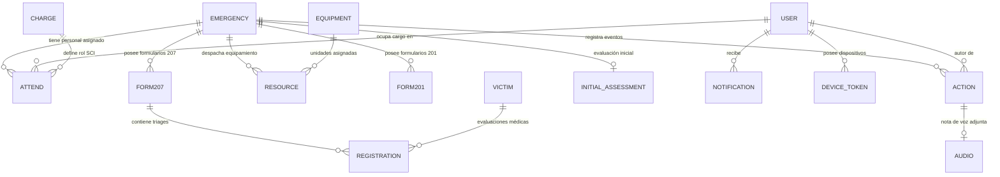

# 04. Modelo de Datos y Entidades del Sistema

Este documento describe la estructura relacional de la base de datos PostgreSQL, las entidades TypeORM, sus atributos, tipos de datos, relaciones de clave foránea e índices de integridad.

---

## 1. Patrón Base: `BaseEntity` y Soft Delete

La gran mayoría de entidades operativas del sistema heredan de `BaseEntity` (`src/common/entities/base.entity.ts`), garantizando consistencia y auditoría temporal:

| Atributo | Tipo DB | Decorador TypeORM | Descripción |
|:---|:---|:---|:---|
| `id` | `uuid` | `@PrimaryGeneratedColumn('uuid')` | Identificador único universal (PK) |
| `isDeleted` | `boolean` | `@Column({ name: 'is_deleted', type: 'boolean', default: false })` | Borrado lógico (Soft delete) |
| `createdAt` | `timestamp` | `@CreateDateColumn({ name: 'created_at' })` | Marca temporal de creación |
| `updatedAt` | `timestamp` | `@UpdateDateColumn({ name: 'updated_at' })` | Marca temporal de última modificación |

> **Excepciones de Inmutabilidad**: Las entidades `RegistrationEntity` (logs de triage), `NotificationEntity` y `AuditLogEntity` no heredan de `BaseEntity` porque son registros históricos de solo inserción (*append-only*), manejando únicamente `id` y `createdAt`.

---

## 2. Diagrama de Relaciones Principales

---

## 3. Detalle de Entidades por Módulo

### 3.1 Módulo de Usuarios y Autenticación

#### `UserEntity` (`table: users`)
- `id`: UUID (PK).
- `name`: `varchar(100)` — Nombre.
- `lastName`: `varchar(100)` — Apellido.
- `email`: `varchar(150)` (Unique).
- `password`: `varchar(255)` (Hash bcrypt).
- `cellphone`: `varchar(20)` — Teléfono.
- `grade`: `varchar(100)` — Grado o jerarquía institucional.
- `birthdate`: `date` — Fecha de nacimiento.
- `role`: `enum` (`BASIC`, `ADVANCED`, `MANAGER`, `ADMIN`).
- `isActive`: `boolean` (default: `true`) — Estado operativo de guardia.
- `refreshToken`: `text` (nullable) — Hash del token de refresco.

#### `DeviceTokenEntity` (`table: device_token`)
- `id`: UUID (PK, hereda de BaseEntity).
- `token`: `varchar(255)` (Unique) — Token FCM generado por el dispositivo.
- `deviceOs`: `varchar(20)` (`android`, `ios`, `web`).
- `user_id`: FK -> `users.id` (ManyToOne, onDelete: CASCADE).

---

### 3.2 Módulo de Emergencias y Evaluación Inicial

#### `EmergencyEntity` (`table: emergency`)
- `id`: UUID (PK, hereda de BaseEntity).
- `code`: `varchar(20)` (Unique) — Correlativo `EMG-XXX`.
- `description`: `varchar(500)` — Descripción del suceso.
- `date`: `date` — Fecha del incidente.
- `time`: `varchar(10)` — Hora del incidente.
- `coordinates_i`: `simple-array` (`[lng, lat]`) — Coordenadas del Incidente.
- `coordinates_pc`: `simple-array` (`[lng, lat]`) — Coordenadas del Puesto de Comando.
- `coordinates_e`: `simple-array` (`[lng, lat]`) — Coordenadas de Área de Espera (Staging).
- `state`: `varchar(1)` (`p` Pendiente, `a` Activa, `f` Finalizada, `c` Cancelada).
- `duration`: `varchar(50)` — Duración total.
- `user_id`: FK -> `users.id` (Creador del incidente).
- `initial_assessment_id`: FK -> `initial_assessment.id` (OneToOne).

#### `InitialAssessmentEntity` (`table: initial_assessment`)
- `id`: UUID (PK, hereda de BaseEntity).
- `hazardAssessment`: `text` — Evaluación de riesgos y amenazas.
- `characterization`: `varchar(255)` — Tipo y magnitud del evento.
- `specialConsiderations`: `text` — Factores críticos y áreas sensibles.
- `initialObjectives`: `text` — Objetivos tácticos de primer ataque.
- `clientGeneratedId`: `uuid` (Unique, nullable) — Idempotencia offline.

---

### 3.3 Módulo de Estructura Organizativa SCI

#### `ChargeEntity` (`table: charge`)
- `id`: UUID (PK, hereda de BaseEntity).
- `name`: `varchar(100)` — Nombre del cargo (ej. Comandante del Incidente).
- `abbreviation`: `varchar(20)` (nullable) — Abreviatura estándar (ej. `CI`, `JOP`, `EQ-ATK`).
- `level`: `int` — Nivel vertical jerárquico (1 a 5).
- `weight`: `decimal(5,2)` — Peso de ordenamiento horizontal en el organigrama.
- `system_name`: `varchar(100)` (Unique, nullable) — Clave programática (ej. `incident_commander`, `medical_unit_leader`, `attack_team`).

#### `AttendEntity` (`table: attend`)
- `id`: UUID (PK, hereda de BaseEntity).
- `user_id`: FK -> `users.id` (ManyToOne).
- `emergency_id`: FK -> `emergency.id` (ManyToOne).
- `charge_id`: FK -> `charge.id` (ManyToOne).
- `charge_system_name`: `varchar(100)` (nullable) — Clave de control de exclusividad de CI.
- `is_active`: `boolean` (default: `true`) — Vigencia en el incidente.
- **Índice Único Parcial**: Solo permite un único Comandante de Incidente activo por emergencia (`WHERE charge_system_name = 'incident_commander' AND is_active = true AND is_deleted = false`).

---

### 3.4 Módulo de Bitácora y Notas de Voz (Audios)

#### `ActionEntity` (`table: action`)
- `id`: UUID (PK, hereda de BaseEntity).
- `description`: `varchar(500)` — Detalle de la acción, orden o novedad.
- `date`: `date` — Fecha del suceso.
- `hour`: `varchar(10)` — Hora del suceso.
- `clientGeneratedId`: `uuid` (Unique, nullable) — Idempotencia offline.
- `user_id`: FK -> `users.id` (ManyToOne).
- `emergency_id`: FK -> `emergency.id` (ManyToOne).
- `audio_id`: FK -> `audio.id` (OneToOne, nullable).

#### `AudioEntity` (`table: audio`)
- `id`: UUID (PK, hereda de BaseEntity).
- `path_audio`: `varchar(500)` — Ruta local `data/audios/{userId}/{emergencyId}/{filename}`.
- `duration`: `decimal(8,2)` — Duración en segundos.
- `processed`: `boolean` (default: `false`) — Estado de procesamiento NLP.
- `file_name`: `varchar(255)` (nullable) — Nombre de archivo.
- `mime_type`: `varchar(50)` (nullable) — Formato MIME (`audio/m4a`, `audio/mp3`, etc.).
- `size_bytes`: `bigint` (nullable) — Tamaño en bytes.
- `transcription`: `text` (nullable) — Transcripción Speech-to-Text.
- `nlp_extracted_data`: `jsonb` (nullable) — Datos estructurados extraídos por NLP.
- `clientGeneratedId`: `uuid` (Unique, nullable).
- `user_id`: FK -> `users.id`.
- `emergency_id`: FK -> `emergency.id`.

---

### 3.5 Módulo de Formularios SCI

#### `Form201Entity` (`table: form201`)
- `id`: UUID (PK, hereda de BaseEntity).
- `code`: `varchar(20)` — Correlativo `F201-XXX`.
- `incidentName`: `varchar(255)` — Nombre asignado al incidente.
- `situationSummary`: `text` — Resumen de situación.
- `initialObjectives`: `text` — Objetivos tácticos.
- `summaryActions`: `text` — Acciones y avances.
- `safetyMessage`: `text` — Medidas de seguridad para las brigadas.
- `organigramaSnapshot`: `jsonb` — Foto fija de los miembros y cargos al crear el F201.
- `isFinalized`: `boolean` (default: `false`).
- `clientGeneratedId`: `uuid` (Unique, nullable).
- `emergency_id`: FK -> `emergency.id`.
- `user_id`: FK -> `users.id`.
- **Índice Único Parcial**: `uq_form201_active_per_emergency` (`WHERE is_deleted = false AND is_finalized = false`) que impide tener 2 F201 activos simultáneos en la misma emergencia.

#### `Form207Entity` (`table: form207`)
- `id`: UUID (PK, hereda de BaseEntity).
- `code`: `varchar(15)` — Correlativo `F207-XXX`.
- `place_of_registration`: `varchar(255)` — Ubicación del Puesto Médico (PMA).
- `attendant`: `varchar(150)` — Nombre del encargado del registro.
- `date`: `date` — Fecha de la planilla.
- `is_finalized`: `boolean` (default: `false`).
- `clientGeneratedId`: `uuid` (Unique, nullable).
- `emergency_id`: FK -> `emergency.id`.
- `user_id`: FK -> `users.id`.

#### `EmergencyForm207CounterEntity` (`table: emergency_form207_counter`)
- `emergency_id`: UUID (PK) — FK -> `emergency.id`.
- `last_value`: `int` — Último valor correlativo generado concurrentemente mediante `UPSERT`.

---

### 3.6 Módulo de Registro de Víctimas y Triage

#### `VictimEntity` (`table: victim`)
- `id`: UUID (PK, hereda de BaseEntity).
- `identifier`: `varchar(50)` (nullable) — Código (ej. `NN-001`) o nombre de la víctima.
- `ageEstimated`: `int` (nullable) — Edad estimada.
- `gender`: `varchar(20)` (nullable) — Género.
- `cellphone`: `varchar(20)` (nullable) — Teléfono personal.
- `referenceCellphone`: `varchar(20)` (nullable) — Teléfono de contacto de emergencia.
- `clientGeneratedId`: `uuid` (Unique, nullable).

#### `RegistrationEntity` (`table: registration`)
- `id`: UUID (PK, autogenerado).
- `classification`: `enum` (`rojo`, `amarillo`, `verde`, `negro`) — Categoría START/SALT.
- `transferredBy`: `varchar(150)` (nullable) — Móvil o ambulancia de traslado.
- `cellphoneTransferManager`: `varchar(20)` (nullable) — Celular del chofer/encargado.
- `notes`: `varchar(500)` (nullable) — Observaciones clínicas.
- `date`: `date` — Fecha del triage.
- `hour`: `varchar(10)` — Hora del triage.
- `createdAt`: `timestamp` — Fecha y hora exacta de captura.
- `clientGeneratedId`: `uuid` (Unique, nullable).
- `victim_id`: FK -> `victim.id` (ManyToOne, onDelete: CASCADE).
- `form207_id`: FK -> `form207.id` (ManyToOne, onDelete: CASCADE).
- `user_id`: FK -> `users.id` (ManyToOne).

---

### 3.7 Módulo de Notificaciones y Auditoría

#### `NotificationEntity` (`table: notification`)
- `id`: UUID (PK).
- `type`: `varchar(30)` (`ci_change`, `form_finalized`, `emergency_state_change`, `sync_conflict`, `resource_assigned`).
- `title`: `varchar(100)` — Título de la notificación.
- `message`: `varchar(255)` — Contenido corto del mensaje.
- `isRead`: `boolean` (default: `false`).
- `createdAt`: `timestamp`.
- `user_id`: FK -> `users.id` (Destinatario).

#### `AuditLogEntity` (`table: audit_logs`)
- `id`: UUID (PK).
- `traceId`: `varchar(50)` (nullable) — ID de correlación HTTP.
- `entityName`: `varchar(100)` — Tabla afectada.
- `entityId`: `varchar(50)` (nullable) — PK del registro afectado.
- `action`: `varchar(20)` (`INSERT`, `UPDATE`, `DELETE`, `SOFT_DELETE`).
- `previousValues`: `jsonb` (nullable) — Snapshot antes del cambio.
- `newValues`: `jsonb` (nullable) — Snapshot después del cambio.
- `userId`: `varchar(50)` (nullable) — Autor del cambio.
- `userRole`: `varchar(50)` (nullable) — Rol del autor.
- `createdAt`: `timestamp`.
